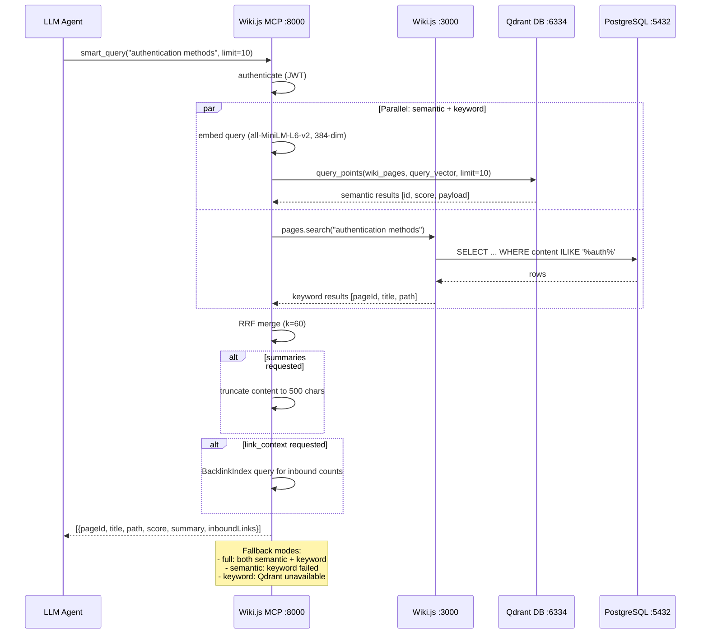
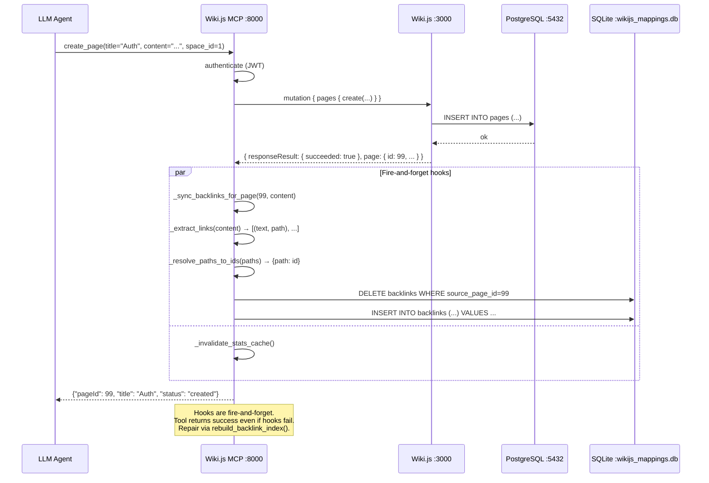
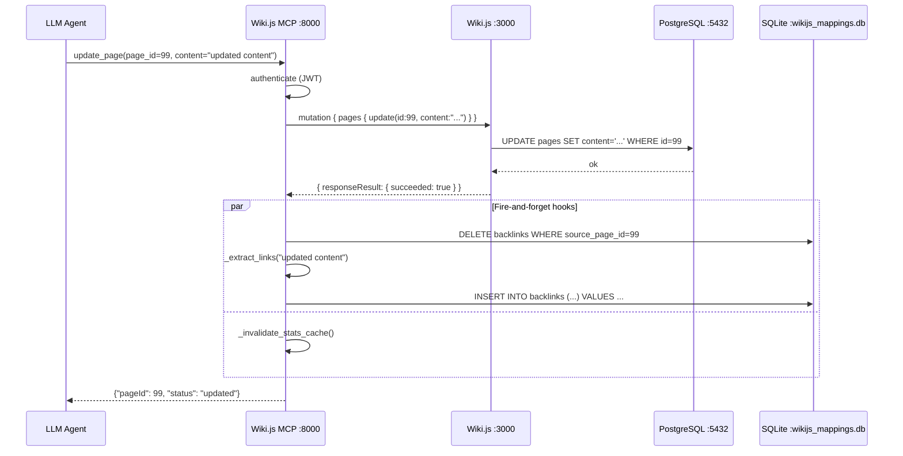
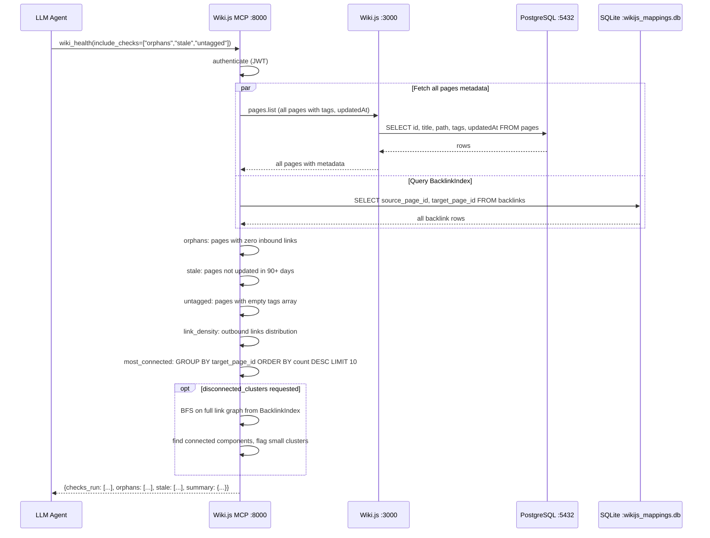
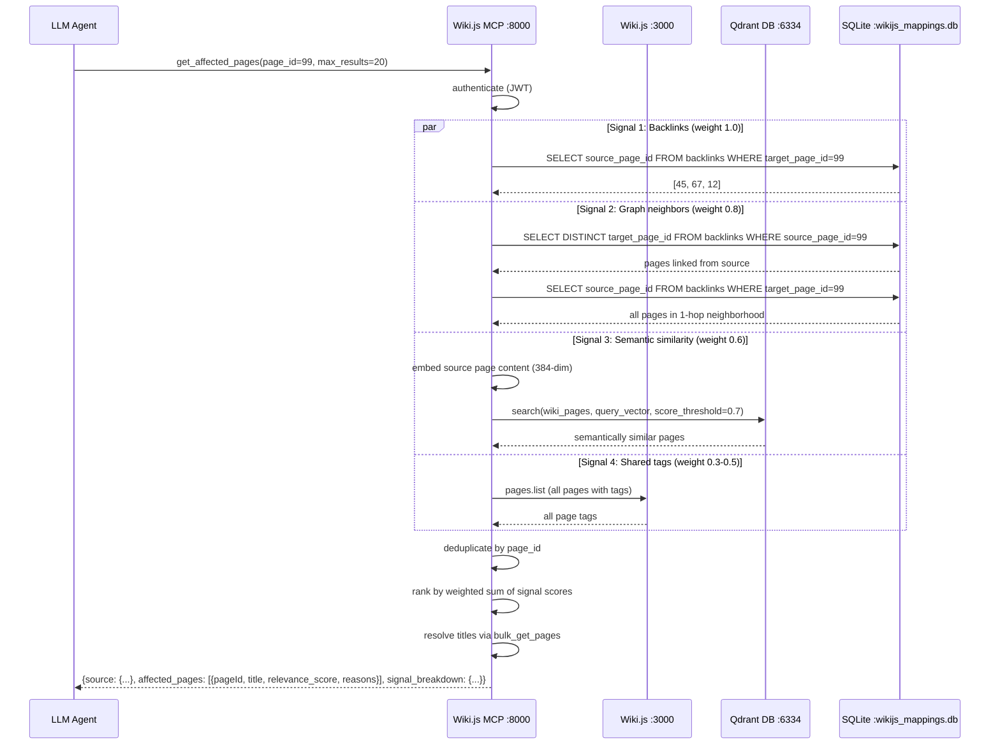
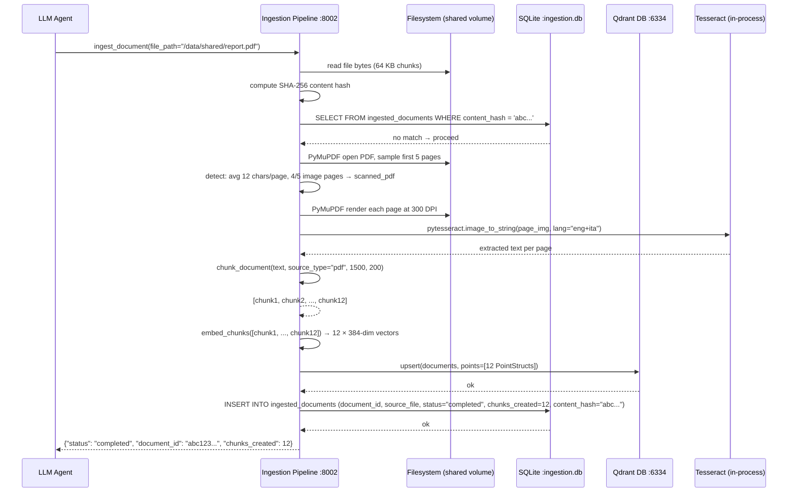
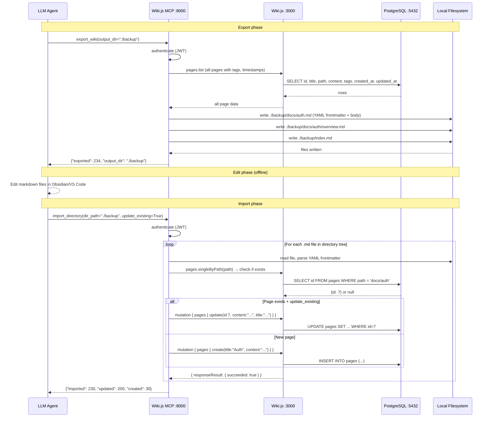
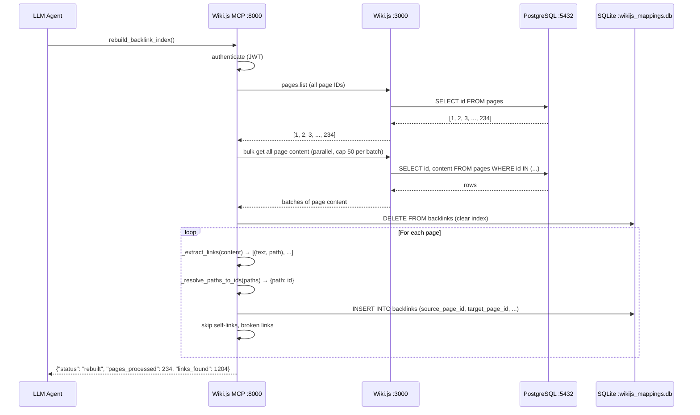
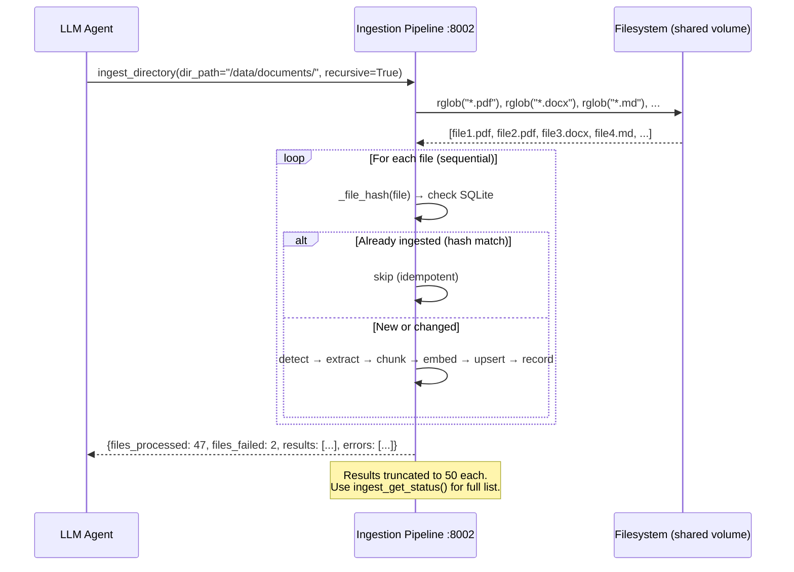

# Data Flow

Request lifecycle diagrams for all major operations in wiki-js-mcp v3. Each section covers a key workflow with a mermaid sequence diagram showing the actors and data transformations involved.

## Semantic Query (`wikijs_smart_query`)

Hybrid search combining Qdrant semantic search and Wiki.js keyword search via Reciprocal Rank Fusion.

## Page Create with Backlink Sync

Creating a page triggers fire-and-forget hooks for backlink indexing and stats cache invalidation.

## Page Update

## Wiki Health (7 Checks)

## Affected Pages (4 Signals)

## Document Ingestion (`ingest_document`)

## Import/Export Markdown Roundtrip

## Rebuild Backlink Index

## Batch Document Import (`ingest_directory`)

## Related Documents

- [System Overview](system-overview.md) — Container topology and startup order
- [Multi-MCP Architecture](multi-mcp-architecture.md) — Communication patterns
- [Ingestion Pipeline Design](ingestion-pipeline-design.md) — Pipeline internals
- [LLM Wiki Workflows](../guides/llm-wiki-workflows.md) — Usage patterns
- [Quick Reference](../reference/quick-reference.md) — All tools at a glance
