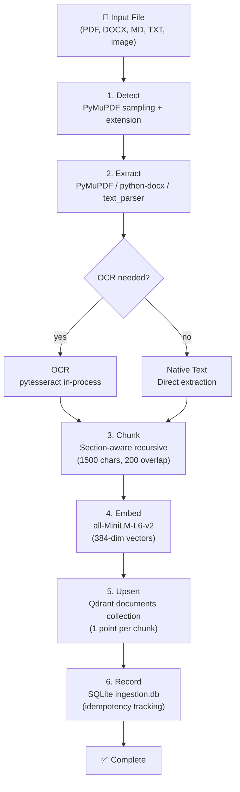
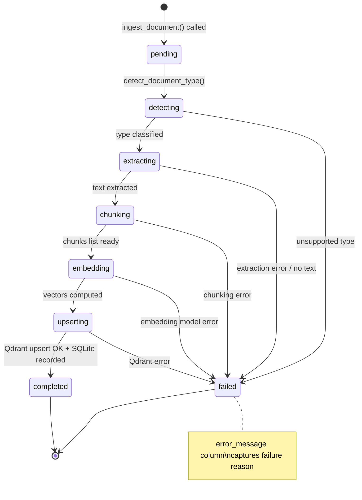

# Ingestion Pipeline Design

Technical design of the document ingestion pipeline (`wikijs_ingestion` container, port 8002). Covers the 6-stage pipeline, OCR routing, chunking algorithm, idempotency, and error handling.

> For tool signatures and container config, see [Ingestion Pipeline MCP](../mcp-servers/ingestion-pipeline-mcp.md).
> For usage workflows, see [OCR and Ingestion Workflows](../guides/ocr-and-ingestion-workflows.md).

## Pipeline Overview



## Stage 1: Detection

**Module:** `detector.py`

Classifies a file into a `subtype` and determines whether OCR is required. Uses a combination of file extension and content sampling.

### Subtypes

| Subtype | Source | OCR Needed | Parser |
|---------|--------|------------|--------|
| `text_pdf` | PDF with extractable text | No | `pdf_parser.extract_text_pdf()` |
| `scanned_pdf` | PDF with no text (image-based) | Yes | `pdf_parser.extract_scanned_pdf()` |
| `text_docx` | DOCX without embedded images | No | python-docx paragraphs |
| `mixed_docx` | DOCX with embedded images | Yes | python-docx + image extraction |
| `markdown` | .md files | No | `text_parser.extract_text()` |
| `text` | .txt, .rst files | No | `text_parser.extract_text()` |
| `image` | .png, .jpg, .tiff, .bmp, .gif, .webp | Yes | Direct pytesseract |
| `unsupported` | Unknown extension | N/A | Error returned |

### PDF classification heuristic

For PDFs, the detector samples the first 5 pages (or fewer) using PyMuPDF:

```
For each sampled page:
  1. Extract native text → count characters
  2. Compute image block coverage ratio via get_text("rawdict")
  3. If image coverage > 80% → mark as image_page

Decision:
  scanned_pdf:  avg_chars_per_page < 50  OR  image_page_ratio > 50%
  text_pdf:    otherwise
```

### DOCX classification

Checks for embedded images by scanning `word/media/` inside the ZIP structure (DOCX is a ZIP archive). If images are found, the subtype is `mixed_docx` and OCR is triggered.

## Stage 2: Extraction

**Modules:** `parsers/pdf_parser.py`, `python-docx`, `parsers/text_parser.py`

### PDF: Hybrid extraction

`extract_pdf_hybrid()` handles mixed PDFs (some text pages, some scanned pages) at the individual page level:

```
For each page:
  text = page.get_text().strip()
  if len(text) > 100 AND word_count > 20:
    → use native text (no OCR)
  else:
    → render page at target DPI (300) via PyMuPDF pixmap
    → convert to PIL Image
    → pytesseract.image_to_string(img, lang="eng+ita")
```

This is more granular than the detection stage: the detector classifies the document as a whole, but `extract_pdf_hybrid` makes a per-page decision. This ensures text pages don't waste time on OCR, and scanned pages get processed correctly.

### DOCX extraction

Uses `python-docx` to iterate paragraphs. For `mixed_docx`, images within paragraphs are also extracted and OCR'd.

### Text/Markdown extraction

`text_parser.py` reads files with encoding fallback: UTF-8 → latin-1 → cp1252 → UTF-8 with replacement characters.

## Stage 3: Chunking

**Module:** `chunker.py`

### Algorithm: two-phase section-aware recursive chunking

**Phase 1: Structural split.** The document is split by its natural structural boundaries:

| Source Type | Boundary | Implementation |
|-------------|----------|----------------|
| PDF, DOCX | Form feed `\f` (page breaks) | `text.split("\f")` |
| Markdown | Heading markers `# Title`, `## Section`, etc. | `_split_by_headings()` via regex `^#{1,6}\s` |
| Text | Paragraph breaks (double newline) | `text.split("\n\n")` |

For markdown, `_split_by_headings()` locates all heading positions with `HEADING_BOUNDARY.finditer()` and slices the text at each heading boundary. Text before the first heading is included as a prefix section.

**Phase 2: Recursive sentence-level split.** If a section exceeds `chunk_size` (default 1500 chars), `_split_section()` splits it further:

```
1. Split section at sentence boundaries via regex (?<=[.!?])\s+
2. Accumulate sentences into current chunk:
   - If current + next_sentence ≤ chunk_size: append to current
   - If current > max_chunk_size (2500): force-split (never let a chunk exceed 2500 chars)
   - Otherwise: emit current, start new chunk with next_sentence
3. Overlap: force-split produces (chunk_size - overlap) stride
```

If no sentence boundaries are found (e.g., raw data), the text is split by fixed stride `chunk_size - overlap`.

### Parameters

| Parameter | Default | Description |
|-----------|---------|-------------|
| `chunk_size` | 1500 | Target characters per chunk (~500 tokens for all-MiniLM-L6-v2) |
| `chunk_overlap` | 200 | Overlap between consecutive chunks (~15%) |
| `max_chunk_size` | 2500 | Hard cap — no chunk exceeds this |

### Why section-aware

Section awareness ensures that chunks correspond to semantic units (paragraphs, sections, pages) rather than arbitrary character offsets. This improves retrieval relevance: a chunk about "Authentication" will contain a complete authentication section, not half of it plus half of the next section.

## Stage 4: Embedding

**Module:** `embedder.py`

### Model

`all-MiniLM-L6-v2` from SentenceTransformers:

- **Dimensions:** 384
- **Model size:** ~80 MB (pre-downloaded in Docker image — no cold start)
- **Normalization:** Vectors are L2-normalized (`normalize_embeddings=True`)

### Lazy singleton

The model is loaded once and shared across all requests:

```python
_model = None

def get_model():
    global _model
    if _model is None:
        _model = SentenceTransformer("all-MiniLM-L6-v2")
    return _model

def embed_chunks(texts):
    return get_model().encode(texts, normalize_embeddings=True).tolist()
```

First call logs the model load. Subsequent calls use the cached model.

### Batching

`embed_chunks()` accepts a list of texts and encodes them in a single batch. SentenceTransformers internally batches by token count. For documents with many chunks (100+), the entire chunk list is passed at once — no manual mini-batching needed.

## Stage 5: Upsert to Qdrant

Each chunk becomes one Qdrant `PointStruct` in the `documents` collection:

```
PointStruct(
    id=str(uuid.uuid4()),
    vector=embedding,               # 384-dim float list
    payload={
        "document_id": document_id,  # content_hash[:16]
        "chunk_index": i,            # 0-based
        "source_file": str(path),
        "file_type": subtype,
        "text": chunk_text,
        "content_hash": sha256(chunk_text)[:16],
        "ingested_at": ISO timestamp,
    },
)
```

Points are upserted in a single batch call via `client.upsert(collection_name, points=points)`.

## Stage 6: Record in SQLite

**Module:** `db.py`

After successful Qdrant upsert, metadata is written to `ingestion.db` (SQLite) for tracking and idempotency.

### Schema

#### `ingested_documents`

| Column | Type | Description |
|--------|------|-------------|
| `id` | Integer PK | Auto-increment |
| `document_id` | String(64) UNIQUE | UUID derived from content hash (first 16 chars) |
| `source_file` | String | Original file path |
| `file_type` | String | Detected subtype (e.g. `text_pdf`, `markdown`) |
| `file_size_bytes` | Integer | File size in bytes |
| `status` | String | `pending`, `processing`, `completed`, `failed` |
| `chunks_created` | Integer | Number of chunks upserted to Qdrant |
| `error_message` | Text | Error detail if status is `failed` |
| `content_hash` | String(64) UNIQUE | SHA-256 of the entire file |
| `ingested_at` | DateTime | UTC timestamp of ingestion |
| `updated_at` | DateTime | UTC timestamp of last update |

#### `document_chunks`

| Column | Type | Description |
|--------|------|-------------|
| `id` | Integer PK | Auto-increment |
| `document_id` | String(64) | Foreign key to `ingested_documents` |
| `chunk_index` | Integer | Position within document |
| `chunk_hash` | String(64) | SHA-256 of chunk text |
| `page_number` | Integer (nullable) | Source page number (PDFs only) |
| `section_title` | String (nullable) | Section heading (markdown only) |
| `created_at` | DateTime | UTC timestamp |

Unique constraint on `(document_id, chunk_index)`.

#### `page_chunk_references`

| Column | Type | Description |
|--------|------|-------------|
| `id` | Integer PK | Auto-increment |
| `wiki_page_id` | Integer | Wiki.js page ID |
| `chunk_id` | Integer | Foreign key to `document_chunks` |
| `document_id` | String(64) | Redundant FK for query convenience |
| `linked_at` | DateTime | UTC timestamp |

Unique constraint on `(wiki_page_id, chunk_id)`. This table tracks which wiki pages reference which ingested chunks (populated when an agent creates wiki pages from ingested content).

### Session lifecycle

Same pattern as Wiki.js MCP:

```python
db = get_db()
try:
    # ... queries or mutations ...
    db.commit()
except Exception:
    db.rollback()
finally:
    db.close()
```

## Idempotency

Idempotency is achieved via **content hashing** at two levels:

### 1. File-level (dedup)

`_file_hash()` computes SHA-256 of the entire file in 64 KB chunks. Before ingestion, the hash is checked against `IngestedDocument.content_hash`:

- **Hash match + not force:** Returns `{"status": "skipped", "reason": "Already ingested"}`
- **Hash match + force=True:** Deletes existing chunks, re-ingests
- **No match:** Proceeds with full pipeline

### 2. Chunk-level (dedup within Qdrant)

Each chunk point includes a `content_hash` in its payload (SHA-256 of chunk text, truncated to 16 chars). This allows detecting and updating individual chunks if the file is re-ingested with `force=True`.

### Force re-ingestion

When `force=True`:

1. Existing Qdrant points for that `document_id` are deleted
2. Existing SQLite rows for that `document_id` are purged
3. Full pipeline runs from scratch

## State Machine

Documents transition through these states:



### State persistence

The `status` field in `IngestedDocument` tracks the current state. If a stage fails:

- The exception is caught in `ingest_document()`
- `{"error": str(e)}` is returned to the caller
- The SQLite row is **not** written (no partial state)

Future enhancement: persist intermediate states so long-running ingestions can be resumed.

## Error Handling

### Per-stage handling

| Stage | Error Class | Behavior | Return |
|-------|-------------|----------|--------|
| Detection | Unsupported extension | Caught; returns error dict | `{"error": "Unsupported file type: .xyz"}` |
| Detection | PyMuPDF error | Falls back to `text_pdf`; logs warning | Continues with fallback |
| Extraction | File read error | Caught; returns error | `{"error": str(e)}` |
| Extraction | No text content | Caught; returns error | `{"error": "No text extracted from document"}` |
| Chunking | Any exception | Propagates to outer try/except | `{"error": str(e)}` |
| Embedding | Model load failure | Propagates to outer try/except | `{"error": str(e)}` |
| Upsert | Qdrant connection error | Propagates to outer try/except | `{"error": str(e)}` |
| Record (SQLite) | Constraint violation | Logged as warning; ingestion considered complete | Success (SQLite is best-effort tracking) |

### SQLite failure is non-blocking

If the SQLite record write fails (e.g., unique constraint on re-ingestion), the error is logged as a warning but the ingestion is still reported as `completed`. The Qdrant data is correct; SQLite is tracking metadata, not source of truth.

### No retry logic

The pipeline does not automatically retry failed stages. The caller (agent or script) should retry the entire `ingest_document()` call. Since the pipeline is idempotent (skip if already ingested), retries are safe.

## Batch Processing (ingest_directory)

**Tool:** `ingest_directory()`

### Strategy: sequential with partial success

```
1. Glob for matching files (default: *.pdf, *.docx, *.md, *.txt, *.png, *.jpg, *.jpeg)
2. For each file, call ingest_document() sequentially
3. Collect successes and errors separately
4. Return summary (truncated to 50 results of each type for readability)
```

### Why sequential, not parallel

The pipeline is CPU-bound (OCR, embedding). Parallel processing would contend for the same CPU cores and potentially degrade performance. Sequential processing with idempotency ensures:

- No duplicate work across runs (re-running `ingest_directory` skips already-ingested files)
- Predictable resource usage
- Clean error isolation (one failed file doesn't affect others)

### Limitation

For very large directories (1000+ files), sequential processing can take a long time. The tool returns intermediate results. Progress can be inspected via `ingest_get_status()`.

## Performance Characteristics

| Document Type | Typical Latency | Bottleneck |
|---------------|-----------------|------------|
| Text PDF (10 pages) | ~2s | PyMuPDF extraction + embedding |
| Scanned PDF (10 pages) | ~30s | pytesseract OCR (3s/page) |
| Text DOCX | ~1s | python-docx parsing + embedding |
| Mixed DOCX (with images) | ~5s | Image extraction + OCR |
| Markdown (< 20 KB) | <0.5s | Text reading + embedding |
| Single image | ~2-3s | pytesseract OCR |
| Batch 100 text files | ~20s | Cumulative embedding |

**Key insight:** OCR (pytesseract) is the dominant cost. The pipeline uses pytesseract in-process (no MCP overhead) for maximum throughput on scanned documents.

## Logging

The pipeline uses Python's `logging` module with a module-level logger (`logging.getLogger(__name__)`). Key log events:

| Event | Level | Message |
|-------|-------|---------|
| Embedding model loaded | INFO | `Loading embedding model: all-MiniLM-L6-v2` |
| Embedding model ready | INFO | `Embedding model loaded (384-dim)` |
| Ingestion complete | INFO (via caller) | Contained in success return value |
| Ingestion failed | ERROR | `Ingestion failed for {path}: {error}` |
| SQLite tracking failed | WARNING | `Failed to track ingestion in SQLite: {error}` |
| PDF detection failed | ERROR | `PDF detection failed for {path}: {error}` |
| DOCX detection failed | ERROR | `DOCX detection failed for {path}: {error}` |

Logs are written to stdout/stderr and captured by Docker. View with:

```bash
docker compose logs ingestion-pipeline
```

## Cross-Server Interaction

The Ingestion Pipeline interacts with two external systems:

```
Ingestion Pipeline (:8002)
  │
  ├── Qdrant (:6334 REST)
  │   ├── client.upsert(collection="documents", points=[...])
  │   ├── client.delete(collection, filter=document_id)
  │   └── client.query_points(collection, query_vector)  [ingest_search_chunks]
  │
  └── Tesseract (in-process, NOT via MCP)
      └── pytesseract.image_to_string(img, lang="eng+ita")
```

**Design decision:** The pipeline calls pytesseract directly (in-process) rather than routing through the Tesseract MCP server on port 8003. This avoids SSE serialization overhead (~30ms per page) for batch processing. The Tesseract MCP server exists for agent-facing ad-hoc OCR — when an LLM needs to extract text from a single image without running the full pipeline.

## Future Enhancements

| Enhancement | Description | See |
|-------------|-------------|-----|
| Parallel batch processing | Process N files concurrently using multiprocessing for CPU-bound OCR | [Improvements](../improvements/index.md) |
| Resume interrupted ingestion | Persist state after each stage so failed runs can resume from the last checkpoint | — |
| Streaming for large files | Stream chunks to Qdrant as they are ready instead of waiting for all embeddings | — |
| Confidence-based OCR routing | Flag low-confidence OCR results for manual review | [Tesseract Research](../guides/tesseract-ocr-research.md) |
| ONNX embedding runtime | Replace PyTorch with ONNX for lighter image and faster inference | [Improvements](../improvements/index.md) |
| Document section metadata | Capture section titles from headings to improve retrieval context | — |

## Related Documents

- [Qdrant Vector DB](qdrant-vector-db.md) — Collection schema and HNSW configuration
- [Database](database.md) — Full SQLite schema (Wiki.js MCP + Ingestion)
- [System Overview](system-overview.md) — 8-container topology
- [Tesseract OCR Research](../guides/tesseract-ocr-research.md) — OCR benchmarks and tradeoffs
- [Ingestion Pipeline MCP](../mcp-servers/ingestion-pipeline-mcp.md) — Tool signatures and container config
