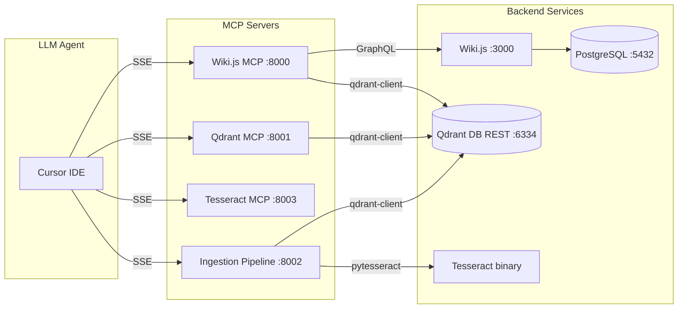

# MCP Server Registry

Catalog of all 4 MCP servers in the v3 ecosystem. Each is an independent Docker container exposing tools via FastMCP SSE transport.

## Registry

| Server | Container | Image | Port | Tools | Depends On |
|--------|-----------|-------|------|-------|------------|
| Wiki.js MCP | `wikijs_mcp` | `wiki-js-mcp:latest` | 8000 | ~43 | setup, wiki |
| Qdrant MCP | `wikijs_qdrant_mcp` | `wiki-js-qdrant-mcp:latest` | 8001 | 8 | qdrant-db |
| Tesseract MCP | `wikijs_tesseract_mcp` | `wiki-js-tesseract-mcp:latest` | 8003 | 7 | -- |
| Ingestion Pipeline | `wikijs_ingestion` | `wiki-js-ingestion-pipeline:latest` | 8002 | 7 | qdrant-db |

## Connection Matrix



## Per-Server Details

### Wiki.js MCP (`:8000`)

- **Source:** `mcp-servers/wiki-js-mcp/`
- **Dependencies:** `python:3.12-slim`, FastMCP, httpx, qdrant-client, SQLAlchemy, aiosqlite
- **Image:** ~200 MB (v2 was ~1.5 GB with sentence-transformers)
- **Documentation:** [wiki-js-mcp.md](../mcp-servers/wiki-js-mcp.md)

### Qdrant MCP (`:8001`)

- **Source:** `mcp-servers/qdrant-mcp/`
- **Dependencies:** `python:3.12-slim`, FastMCP, qdrant-client, sentence-transformers
- **Image:** ~800 MB (includes pre-downloaded all-MiniLM-L6-v2 model ~80 MB)
- **Design:** Does NOT route through SSE for integration tests -- tests import tools directly
- **Documentation:** [qdrant-mcp.md](../mcp-servers/qdrant-mcp.md)

### Tesseract MCP (`:8003`)

- **Source:** `mcp-servers/tesseract-mcp/`
- **Dependencies:** `python:3.12-slim`, Tesseract OCR (eng+ita), PyMuPDF, pytesseract, Pillow
- **Image:** ~300 MB
- **Note:** Ingestion Pipeline uses pytesseract in-process for batch performance. Tesseract MCP is for agent-facing OCR.
- **Documentation:** [tesseract-mcp.md](../mcp-servers/tesseract-mcp.md)

### Ingestion Pipeline (`:8002`)

- **Source:** `mcp-servers/ingestion-pipeline/`
- **Dependencies:** `python:3.12-slim`, FastMCP, qdrant-client, sentence-transformers, PyMuPDF, pytesseract, python-docx
- **Image:** ~1 GB (includes Tesseract + pre-downloaded sentence-transformers model)
- **Documentation:** [ingestion-pipeline-mcp.md](../mcp-servers/ingestion-pipeline-mcp.md)

## Service Lifecycle

All 4 MCP servers follow the same startup pattern:

1. **Dockerfile**: Base image + system packages + pip install + COPY source
2. **server.py**: Create `FastMCP` instance, import tool modules (side-effect registration via `@mcp.tool()`), connect to backend (authenticate Wiki.js or verify Qdrant), run SSE transport
3. **Healthcheck**: TCP port check via `/dev/tcp/localhost/<port>`

## Dependency Chain

```
db ──► wiki ──► setup ──► wiki-js-mcp (Wiki.js MCP)
                            ▲
qdrant-db ──► qdrant-mcp ──┤
qdrant-db ──► ingestion-pipeline
tesseract-mcp (independent)
```
