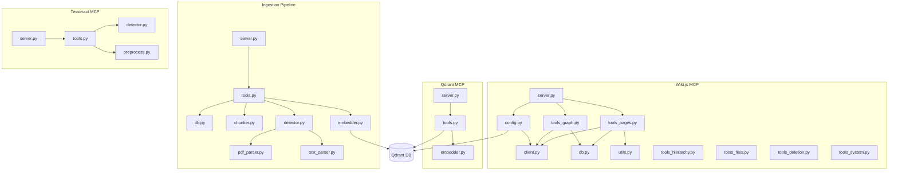

# Modules

v3 distributes Python modules across 4 independent repositories, unlike v2 which had a single `wiki_mcp_server` package with 8 modules.

## Repository Map

```
mcp-servers/wiki-js-mcp/             # Wiki.js MCP (Python)
└── src/wiki_mcp_server/
    ├── server.py                    # FastMCP entry point
    ├── client.py                    # Wiki.js GraphQL client (httpx + JWT)
    ├── config.py                    # Pydantic Settings (env vars + Qdrant URL)
    ├── db.py                        # SQLAlchemy models (FileMapping, BacklinkIndex)
    ├── utils.py                     # AST, hash, repo helpers
    ├── tools_pages.py               # Page management (~25 tools)
    ├── tools_graph.py               # Link graph (3 tools)
    ├── tools_hierarchy.py           # Hierarchy (4 tools)
    ├── tools_files.py               # File integration (4 tools)
    ├── tools_deletion.py            # Deletion (4 tools)
    └── tools_system.py              # System (3 tools)

mcp-servers/qdrant-mcp/              # Qdrant MCP (Python)
└── src/qdrant_mcp/
    ├── server.py                    # FastMCP entry point
    ├── tools.py                     # 8 Qdrant tools
    └── embedder.py                  # Lazy SentenceTransformer singleton

mcp-servers/ingestion-pipeline/      # Ingestion Pipeline (Python)
└── src/ingestion_pipeline/
    ├── server.py                    # FastMCP entry point
    ├── tools.py                     # 7 ingestion tools
    ├── db.py                        # SQLAlchemy models (IngestedDocument, etc.)
    ├── chunker.py                   # Section-aware recursive chunking
    ├── embedder.py                  # Lazy SentenceTransformer singleton
    ├── detector.py                  # PyMuPDF file type detection
    ├── pdf_parser.py                # PDF text extraction (hybrid)
    └── text_parser.py               # Text/Markdown parser

mcp-servers/tesseract-mcp/           # Tesseract MCP (Python)
└── src/tesseract_mcp/
    ├── server.py                    # FastMCP entry point
    ├── tools.py                     # 7 OCR tools
    ├── detector.py                  # PyMuPDF text sampling heuristic
    └── preprocess.py                # Grayscale, deskew, denoise, sharpen
```

## Module Dependency Graph



## Module Reference

### Wiki.js MCP (`mcp-servers/wiki-js-mcp/`)

**`server.py`** — Entry point. Creates `FastMCP("Wiki.js Integration")` instance. `_register_tools()` imports all `tools_*` modules (side-effect registration via `@mcp.tool()`). `main()` runs `wikijs.authenticate()` then `mcp.run(transport="sse")`.

**`client.py`** — Wiki.js GraphQL client. `WikiJSClient` class: async HTTP client with JWT auth. `authenticate()` uses double-checked `asyncio.Lock` to prevent race conditions. `graphql_request()` POSTs to `/graphql` with tenacity retry (3 attempts, 4-10s exponential backoff). Global singleton: `wikijs = WikiJSClient()`.

**`config.py`** — Configuration via `pydantic_settings.BaseSettings`. Reads from `.env` and environment variables. Key settings: `WIKIJS_API_URL`, `WIKIJS_TOKEN`, `QDRANT_URL`, `WIKIJS_MCP_DB`, `LOG_LEVEL`. Logger configured at module level (file + stream handlers).

**`db.py`** — SQLAlchemy 2.x declarative models on SQLite. 3 tables: `FileMapping`, `RepositoryContext`, `BacklinkIndex`. `get_db()` factory returns new `SessionLocal()` session. Tables auto-created at import time via `Base.metadata.create_all(engine)`. See [Database](database.md) for full schema.

**`utils.py`** — Utilities: `get_file_hash()` (SHA-256), `extract_code_structure()` (AST parsing for Python classes/functions/imports), `find_repository_root()` (Git root detection), markdown and HTML conversion helpers.

**`tools_pages.py`** — Page management (25 tools). The largest module. Contains CRUD, search, bulk, backlinks, stats, append, tags, smart_query, recent changes, wiki health, wiki stats, affected pages, import/export. Helper functions: `_extract_links`, `_resolve_paths_to_ids`, `_sync_backlinks_for_page`.

**`tools_graph.py`** — Link graph (3 tools). `wikijs_extract_page_links` (classifies internal/external links, flags broken), `wikijs_get_page_graph` (BFS traversal with cycle detection, max_nodes cap), `wikijs_find_shortest_path` (bidirectional BFS between two pages).

**`tools_hierarchy.py`** — Hierarchy (4 tools). Path-based nested pages: `create_repo_structure`, `create_nested_page`, `get_page_children`, `create_documentation_hierarchy`.

**`tools_files.py`** — File integration (4 tools). Maps local file paths to wiki page IDs via `FileMapping`. `link_file_to_page`, `sync_file_docs`, `generate_file_overview` (AST-based markdown), `bulk_update_project_docs`.

**`tools_deletion.py`** — Deletion (4 tools). Safe deletion with cleanup: `delete_page`, `batch_delete_pages`, `delete_hierarchy` (subtree deletion), `cleanup_orphaned_mappings`.

**`tools_system.py`** — System (3 tools). `connection_status` (Wiki.js + Qdrant connectivity), `repository_context` (repo root + file mappings), `manage_collections`.

### Qdrant MCP (`mcp-servers/qdrant-mcp/`)

**`server.py`** — Entry point. Creates FastMCP instance, verifies Qdrant connectivity on startup, registers tools.

**`tools.py`** — 8 Qdrant tools. Collection management (create, list, info, delete), semantic search with payload filters and score threshold, upsert chunks with batch support, delete by filter, scroll pagination.

**`embedder.py`** — Lazy `SentenceTransformer("all-MiniLM-L6-v2")` singleton. `compute_embedding(text)` returns 384-dim vector. Shared pattern with Ingestion Pipeline.

### Ingestion Pipeline (`mcp-servers/ingestion-pipeline/`)

**`server.py`** — Entry point. Creates FastMCP instance, verifies Qdrant and filesystem access, registers tools.

**`tools.py`** — 7 ingestion tools. `ingest_detect_type` (classify file), `ingest_document` (full pipeline), `ingest_directory` (batch), `ingest_get_status`/`ingest_list_documents` (monitoring), `ingest_search_chunks` (semantic search within documents), `ingest_delete_document` (cleanup).

**`db.py`** — SQLAlchemy models: `IngestedDocument`, `DocumentChunk`, `PageChunkReference`. Tracks ingestion history for idempotency and monitoring.

**`chunker.py`** — Section-aware recursive chunking. Targets ~1500 chars per chunk with 200 char overlap. Respects paragraph and section boundaries.

**`embedder.py`** — Lazy `SentenceTransformer("all-MiniLM-L6-v2")` singleton. Same pattern as Qdrant MCP.

**`detector.py`** — PyMuPDF-based file type detection and OCR requirement classification. Determines whether a PDF page is text-based, scanned, or mixed.

**`pdf_parser.py`** — Hybrid PDF text extraction. Uses PyMuPDF native text for text-based pages, routes scanned pages to pytesseract OCR.

**`text_parser.py`** — Text and Markdown parser. Handles `.md` and `.txt` files with structure-aware parsing.

### Tesseract MCP (`mcp-servers/tesseract-mcp/`)

**`server.py`** — Entry point. Creates FastMCP instance, verifies Tesseract binary and language packs, registers tools.

**`tools.py`** — 7 OCR tools. Text extraction, document type detection, HOCR structured output, per-word confidence scores, language listing, smart document processing, preprocessing pipeline.

**`detector.py`** — PyMuPDF text sampling heuristic. Classifies PDF pages as text-based, scanned, or mixed using multi-signal analysis (native text, text coverage ratio, image count).

**`preprocess.py`** — OCR preprocessing pipeline. Grayscale conversion, deskew (straighten rotated text), adaptive thresholding (binarization), denoising, sharpening.

## Key Design Patterns

### Tool Registration (all 4 servers)

Each server's `server.py` imports tool modules, triggering `@mcp.tool()` decorator side-effect registration:

```python
mcp = FastMCP("Server Name")

# Import triggers @mcp.tool() registration
from qdrant_mcp import tools  # No explicit registration needed
```

### Embedder Singleton (Qdrant MCP + Ingestion)

Both Qdrant MCP and Ingestion Pipeline use the same lazy singleton pattern for `all-MiniLM-L6-v2`:

```python
_embedder = None

def compute_embedding(text: str) -> list[float]:
    global _embedder
    if _embedder is None:
        from sentence_transformers import SentenceTransformer
        _embedder = SentenceTransformer("all-MiniLM-L6-v2")
    return _embedder.encode(text).tolist()
```

### Direct Library Access

Wiki.js MCP and Ingestion Pipeline use `qdrant-client` directly (not via Qdrant MCP SSE) for performance:

```python
from qdrant_client import QdrantClient
client = QdrantClient(url=settings.QDRANT_URL)
client.search(collection_name="wiki_pages", query_vector=vec, limit=10)
```

The Qdrant MCP server provides agent-facing vector operations, while internal services use the client library directly.

### DB Session Lifecycle (Wiki.js MCP + Ingestion)

Both servers with SQLite follow the same session pattern:

```python
db = get_db()
try:
    rows = db.query(Model).filter(...).all()
    db.commit()  # Writes only
except Exception:
    db.rollback()
finally:
    db.close()
```
