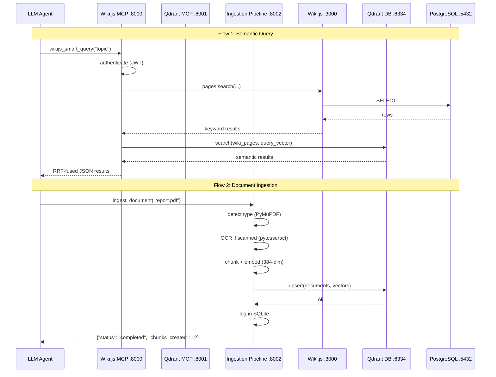

# System Overview

wiki-js-mcp v3 is an 8-container Docker stack providing 4 independent MCP servers wrapping Wiki.js with Qdrant vector search, Tesseract OCR, and document ingestion.

## Components

| Component | Container | Role | Port |
|-----------|-----------|------|------|
| **PostgreSQL** | `wikijs_db` | Wiki.js persistence | internal 5432 |
| **Wiki.js** | `wikijs_app` | Self-hosted wiki engine (GraphQL) | 3000 |
| **Setup** | `wikijs_setup` | One-shot initial setup via `POST /finalize` | -- |
| **Wiki.js MCP** | `wikijs_mcp` | ~43 tools wrapping Wiki.js GraphQL + Qdrant | 8000 |
| **Qdrant DB** | `wikijs_qdrant` | Vector database (semantic search) | 6333 (gRPC) / 6334 (REST) |
| **Qdrant MCP** | `wikijs_qdrant_mcp` | 8 tools wrapping Qdrant REST API | 8001 |
| **Ingestion Pipeline** | `wikijs_ingestion` | Document processing with OCR | 8002 |
| **Tesseract MCP** | `wikijs_tesseract_mcp` | Agent-facing OCR tools | 8003 |

## Data Flow



## Startup Order

1. `db` starts -- health check via `pg_isready`
2. `wiki` starts after db healthy -- health check via `curl localhost:3000`
3. `setup` runs after wiki healthy -- calls `POST /finalize` -- exits
4. `qdrant-db` starts -- health check via gRPC :6333
5. `wiki-js-mcp` starts after setup success + wiki healthy -- serves SSE on :8000
6. `qdrant-mcp` starts after qdrant-db healthy -- serves SSE on :8001
7. `ingestion-pipeline` starts after qdrant-db healthy -- serves SSE on :8002
8. `tesseract-mcp` starts independently -- serves SSE on :8003

## Volumes

| Volume | Mount | Purpose |
|--------|-------|---------|
| `db_data` | `/var/lib/postgresql/data` | PostgreSQL persistence |
| `mcp_data` | `/data` | SQLite database (`wikijs_mappings.db`) |
| `mcp_logs` | `/logs` | MCP server logs |
| `qdrant_data` | `/qdrant/storage` | Qdrant vector data |
| `qdrant_snapshots` | `/qdrant/snapshots` | Qdrant backup snapshots |
| `shared_data` | `/data/shared` | Shared files (read-only for MCP servers) |
| `ingestion_data` | `/data` | Ingestion SQLite database (`ingestion.db`) |

## Network

All 8 containers share the `wikijs-net` bridge network. Inter-container communication uses Docker service names: `wiki:3000`, `db:5432`, `qdrant-db:6334`, etc.

## MCP Transports

Each of the 4 MCP servers uses **SSE** (Server-Sent Events) via FastMCP:

```json
{
  "mcpServers": {
    "wiki-js":     { "url": "http://localhost:8000/sse" },
    "qdrant":      { "url": "http://localhost:8001/sse" },
    "tesseract":   { "url": "http://localhost:8003/sse" },
    "ingestion":   { "url": "http://localhost:8002/sse" }
  }
}
```

For more details on the multi-MCP design, see [Multi-MCP Architecture](multi-mcp-architecture.md).
