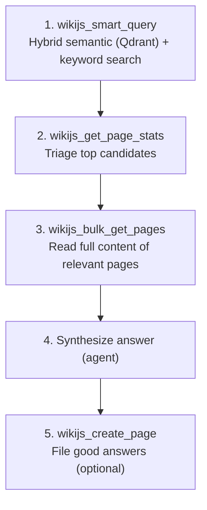
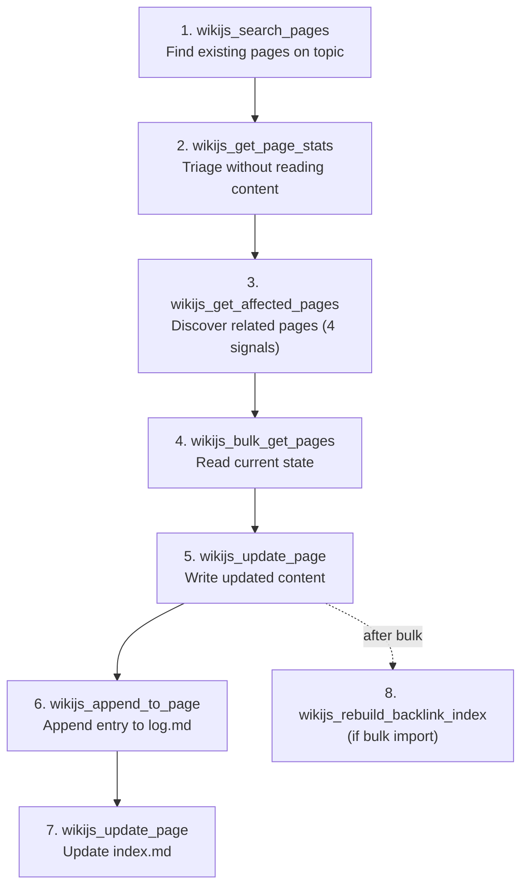
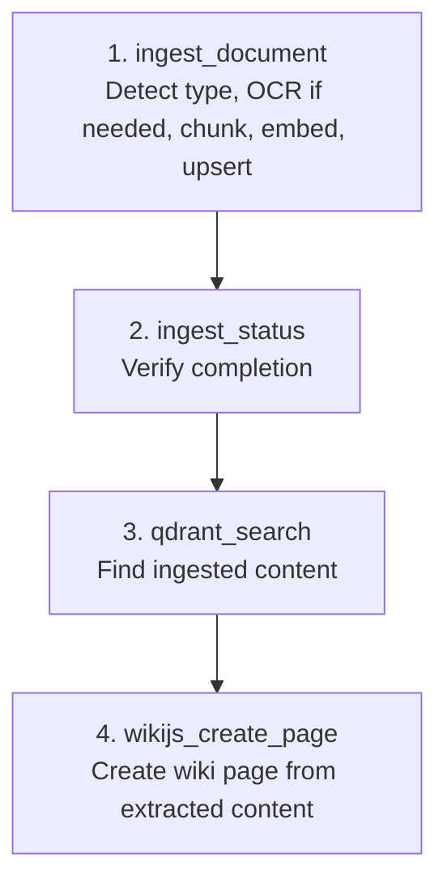
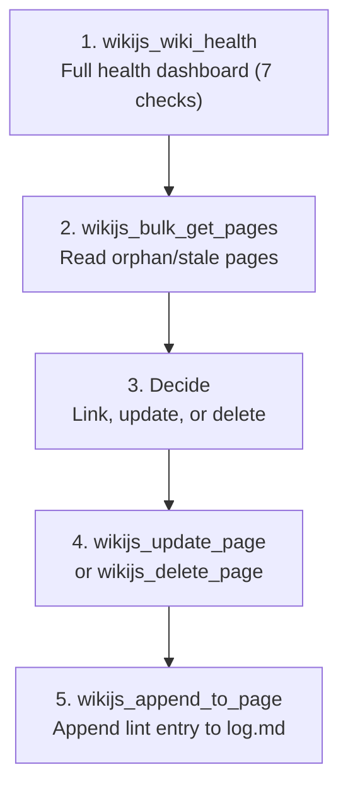
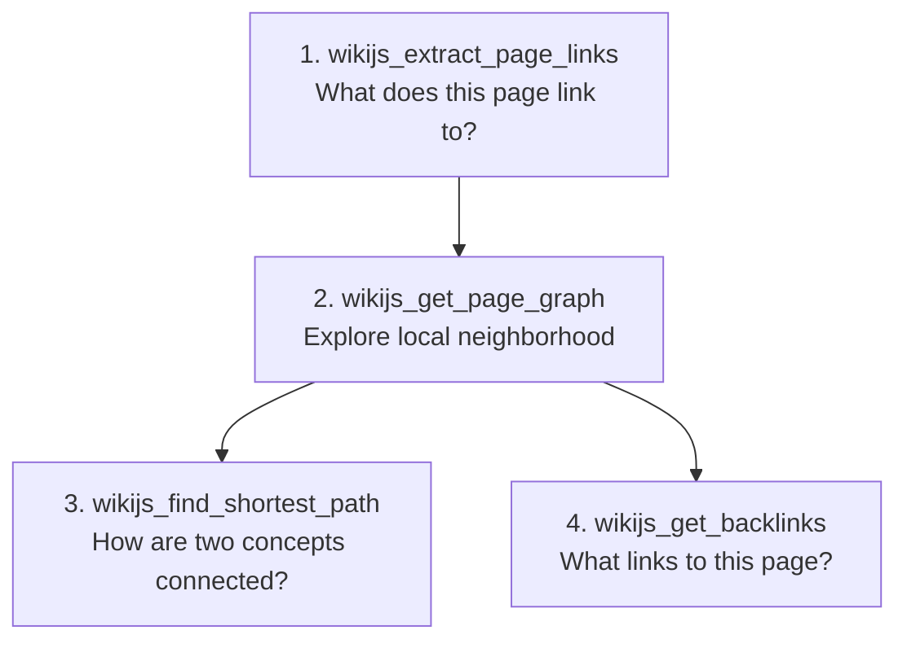

# LLM Wiki Workflows (v3)

The LLM Wiki pattern defines four core operations: **Ingest**, **Query**, **Lint**, and **Document Processing**. Each workflow uses specific wiki-js-mcp v3 tools. v3 adds OCR and document ingestion to the traditional workflows.

## Query Workflow

Answer a question by finding and synthesizing wiki content with semantic search.

**Tool sequence:**
1. `wikijs_smart_query("natural language question", limit=10)` -- ranked results with RRF fusion
2. `wikijs_get_page_stats(top_3_ids)` -- verify relevance via metadata
3. `wikijs_bulk_get_pages(relevant_ids)` -- read full content
4. Synthesize answer with citations
5. `wikijs_create_page(title="Query: ...", content=answer)` -- file good answers

**v3 advantage:** `wikijs_smart_query` uses Qdrant for semantic search, replacing the v2 embedded vector engine. Results are more accurate and the wiki-mcp image is 7x smaller.

## Ingest Workflow

Process new knowledge and integrate it into the wiki. v3 adds document pipeline support.

**Tool sequence:**
1. `wikijs_search_pages("topic keywords")` -- find existing pages
2. `wikijs_get_page_stats(candidate_ids)` -- triage relevance
3. `wikijs_get_affected_pages(core_page_id)` -- 4-signal impact analysis
4. `wikijs_bulk_get_pages(affected_ids)` -- read current state
5. `wikijs_update_page(id, content=updated)` -- write new content
6. `wikijs_append_to_page(log_id, "## [date] ingest | Title")` -- append to log
7. `wikijs_update_page(index_id, content=updated_index)` -- update index
8. `wikijs_rebuild_backlink_index()` -- only after bulk imports

**v3 advantage:** `wikijs_get_affected_pages` replaces manual backlink+graph+semantic checks with one automated call.

## Document Processing Workflow (NEW in v3)

Ingest external documents (PDF, DOCX, images, markdown) into Qdrant for semantic search.

**Tool sequence:**
1. `ingest_document(file_path="report.pdf")` -- full pipeline: detect -> extract -> chunk -> embed -> upsert
2. `ingest_status(document_id=doc_id)` -- verify chunks created
3. `qdrant_search("documents", "topic")` -- find relevant chunks
4. `wikijs_create_page(title="From: report.pdf", content=extracted_text)` -- create wiki page

See [OCR and Ingestion Workflows](ocr-and-ingestion-workflows.md) for detailed document processing patterns.

## Lint Workflow

Run health checks and fix issues.

**Tool sequence:**
1. `wikijs_wiki_health()` -- dashboard of all issues (orphans, stale, untagged, etc.)
2. `wikijs_bulk_get_pages(orphan_ids + stale_ids)` -- read problematic pages
3. Decide: link orphans, update stale, delete obsolete
4. Execute fixes via `wikijs_update_page` / `wikijs_delete_page`
5. `wikijs_append_to_page(log_id, "## [date] lint | Summary")` -- record in log

**Scale tip:** Use `include_checks=["orphans", "stale"]` to scope health checks. Run full health (7 checks) weekly.

## Navigation Workflow

Explore the wiki graph structure.

**Tool sequence:**
1. `wikijs_extract_page_links(page_id)` -- classify internal/external links
2. `wikijs_get_page_graph(page_id, depth=1, direction="both")` -- immediate neighbors
3. `wikijs_find_shortest_path(from_id, to_id)` -- connection path
4. `wikijs_get_backlinks(page_id)` -- all inbound links

## Scale Rules

1. **Never read one-by-one**: Use `wikijs_bulk_get_pages` for any batch read of 2+ pages (cap: 50)
2. **Triage before reading**: Use `wikijs_get_page_stats` or `wikijs_wiki_health` to identify which pages matter
3. **Batch limit is 50**: Above 50, use `wikijs_smart_query`, `wikijs_wiki_health`, or paginate
4. **Append to log**: The log is append-only. Use `wikijs_append_to_page`, not read-modify-write
5. **Cross-references are the backbone**: When updating a page, use `wikijs_get_affected_pages` to find all related pages
6. **Ingest documents before referencing**: Use `ingest_document` before `wikijs_smart_query` if the content is from external files
