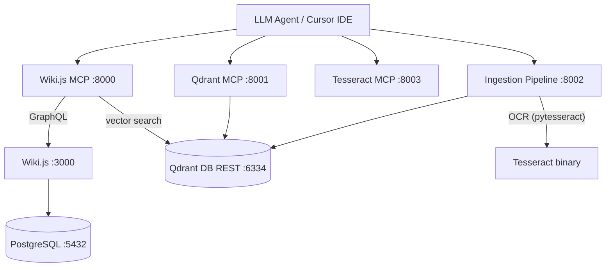

# wiki-js-mcp v3 Documentation

Multi-MCP server ecosystem wrapping Wiki.js with Qdrant vector search, Tesseract OCR, and document ingestion pipeline.

**~65 tools across 4 MCP servers in 8 Docker containers.**

## Quick Navigation

| Section | Description | Best for |
|---------|-------------|----------|
| [Architecture](architecture/index.md) | 8-container stack, Qdrant, multi-MCP design | Understanding system design |
| [MCP Servers](mcp-servers/index.md) | Per-server tool catalogs and configuration | Looking up a specific server |
| [Features](features/index.md) | Tool features by priority and MCP server | Understanding what tools do |
| [Patterns](patterns/index.md) | Code patterns, cross-server communication | Understanding conventions |
| [Guides](guides/index.md) | Quickstart, workflows, Docker operations | How-to instructions |
| [Tool Catalog](reference/tool-catalog.md) | All ~65 tools with signatures | Looking up tool parameters |
| [Reference](reference/index.md) | Configuration, testing, test results | Technical reference |
| [Migration](migration/index.md) | v2 to v3 migration steps | Migrating from v2 |
| [Improvements](improvements/index.md) | Roadmap and enhancement opportunities | Future plans

## System at a Glance

## MCP Server Map

| Server | Container | Port | Tools |
|--------|-----------|------|-------|
| Wiki.js MCP | `wikijs_mcp` | 8000 | ~43 |
| Qdrant MCP | `wikijs_qdrant_mcp` | 8001 | 8 |
| Tesseract MCP | `wikijs_tesseract_mcp` | 8003 | 7 |
| Ingestion Pipeline | `wikijs_ingestion` | 8002 | 7 |

## What Changed from v2

| Aspect | v2 | v3 |
|--------|-----|-----|
| Containers | 4 | 8 |
| Vector engine | Embedded (SQLite+MiniLM) | External Qdrant |
| MCP servers | 1 | 4 |
| OCR | None | Tesseract (CPU) |
| Ingestion | None | Full pipeline |
| Image size (wiki-mcp) | ~1.5 GB | ~200 MB |
| Total tools | 45 | ~65 |

## Reading Order

### For human operators

1. [Quickstart](guides/quickstart.md) — Get the 8-container stack running
2. [Multi-MCP Setup](guides/multi-mcp-setup.md) — Configure Cursor for 4 MCP servers
3. [Docker Operations](guides/docker-operations.md) — Build, test, debug commands

### For LLM agents

1. [Quick Reference](reference/quick-reference.md) — Start here: all tools, collections, workflows, and ports on one page
2. [System Overview](architecture/system-overview.md) — The 8 containers, how they connect
3. [Multi-MCP Architecture](architecture/multi-mcp-architecture.md) — Why 4 servers, how they communicate
4. [MCP Server Registry](architecture/mcp-server-registry.md) — Which server does what
5. [Qdrant Vector DB](architecture/qdrant-vector-db.md) — Collection schemas, embedding model, backup
6. [Ingestion Pipeline Design](architecture/ingestion-pipeline-design.md) — How documents are processed end-to-end
7. [Database](architecture/database.md) — What's stored in SQLite vs Qdrant
8. [LLM Wiki Workflows](guides/llm-wiki-workflows.md) — Core operating patterns (Ingest, Query, Lint)
9. [Tool Catalog](reference/tool-catalog.md) — All ~65 tools with full signatures
10. [Error Catalog](reference/error-catalog.md) — Common errors and solutions
11. [Features](features/index.md) — Feature catalog by priority level
