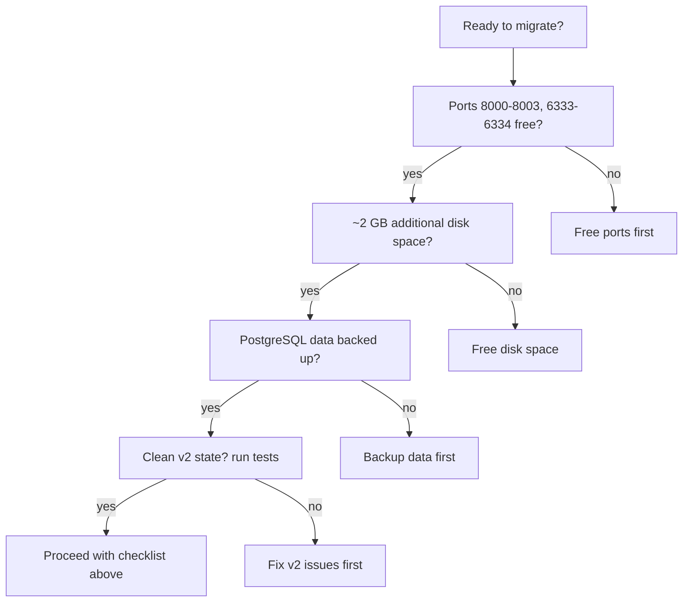

# Migration: v2 to v3

Guide for migrating from wiki-js-mcp v2 (monolithic MCP server) to v3 (multi-MCP ecosystem).

## Quick Migration Checklist

1. Copy `.env.example` to `.env` (it now includes v3 variables) and set `POSTGRES_PASSWORD`
2. Update Cursor `mcp.json` to add 4 MCP servers (see [Cursor Configuration](#cursor-configuration))
3. `docker compose pull` (or `docker compose build` if building locally)
4. `docker compose up -d`
5. Verify: `docker compose ps` shows 8 containers (7 running, setup exited with code 0), `curl -s -o /dev/null -w '%{http_code}' http://localhost:8000/sse` (expect 200)



## Before You Migrate

### Prerequisites

- Docker and Docker Compose (same as v2)
- Ports **8000-8003** and **6333-6334** available (no other services using them)
- ~2 GB additional disk space (new Qdrant container + 3 new MCP server images)
- `git` access to the v3 branch/tag

### Data Safety

- **PostgreSQL** (Wiki.js content) is **unchanged** — your wiki data is safe
- **SQLite** (FileMapping, BacklinkIndex) is rebuilt on first use — no manual migration needed
- **Volumes** `db_data`, `mcp_data`, `mcp_logs` are preserved
- **Recommended**: Run v2 tests before migrating to confirm a clean state:

```bash
docker compose exec -T wiki-js-mcp python3 /app/scripts/test_all_tools.py
```

## What Changed

### What's new in v3

| Addition | Description |
|----------|-------------|
| **Qdrant vector database** | External vector engine replacing embedded `sentence-transformers` + SQLite `PageVector` |
| **Qdrant MCP** (:8001) | 8 tools for vector search, collection management |
| **Tesseract MCP** (:8003) | 7 tools for OCR text extraction, document classification |
| **Ingestion Pipeline** (:8002) | 7 tools for document processing (detect → extract → chunk → embed → upsert) |
| **~65 total tools** | Up from 45 in v2 |

### What changed

| Aspect | v2 | v3 |
|--------|----|----|
| Containers | 4 | 8 (adds qdrant-db, qdrant-mcp, ingestion-pipeline, tesseract-mcp) |
| MCP servers | 1 | 4 |
| Wiki.js MCP image | ~1.5 GB (torch + sentence-transformers) | ~200 MB |
| Cursor config | 1 MCP server | 4 MCP servers |
| Test commands | `docker compose exec wiki-js-mcp` | `docker compose --profile test run --rm test-runner` |

### What was removed

| v2 Feature | v3 Replacement |
|------------|----------------|
| `wikijs_vector_search` | `wikijs_smart_query` (semantic path via Qdrant) |
| `wikijs_rebuild_vector_index` | `qdrant_upsert_chunks` (Qdrant MCP) |
| `PageVector` SQLite model | Qdrant `wiki_pages` collection |
| Embedded `sentence-transformers` | Externalized to Qdrant MCP + Ingestion Pipeline |

## Docker Compose

### v2

```bash
docker compose up -d    # 4 containers
```

### v3

```bash
docker compose up -d    # 8 containers
```

All v2 volumes (`db_data`, `mcp_data`, `mcp_logs`) and networks are preserved. The `db`, `wiki`, and `setup` services are unchanged.

### New services in v3

| Service | Container | Port | Purpose |
|---------|-----------|------|---------|
| `qdrant-db` | `wikijs_qdrant` | 6334 (REST) | Vector database |
| `qdrant-mcp` | `wikijs_qdrant_mcp` | 8001 | MCP wrapper for Qdrant |
| `tesseract-mcp` | `wikijs_tesseract_mcp` | 8003 | Agent-facing OCR |
| `ingestion-pipeline` | `wikijs_ingestion` | 8002 | Document processing |

### Test Commands

**v2:**

```bash
docker compose exec wiki-js-mcp python3 scripts/test_all_tools.py
```

**v3:**

```bash
# Fast tests (Qdrant only, no full stack needed)
docker compose --profile test run --rm test-runner pytest tests/ -v

# Full stack tests
docker compose up -d
docker compose --profile integration run --rm test-runner \
  pytest tests/integration/stack/ tests/regression/ -v
```

The `--profile test` flag is new in v3. It runs the test-runner with only `qdrant-db` as a dependency, keeping tests fast.

## Cursor Configuration

### v2

```json
{
  "mcpServers": {
    "wiki-js": { "url": "http://localhost:8000/sse" }
  }
}
```

### v3

```json
{
  "mcpServers": {
    "wikijs":     { "type": "sse", "url": "http://localhost:8000/sse" },
    "qdrant":     { "type": "sse", "url": "http://localhost:8001/sse" },
    "ingestion":  { "type": "sse", "url": "http://localhost:8002/sse" },
    "tesseract":  { "type": "sse", "url": "http://localhost:8003/sse" }
  }
}
```

After updating, restart Cursor to discover the new servers and their ~65 tools.

## Environment Variables

Copy `.env.example` (updated with v3 variables) and set `POSTGRES_PASSWORD`. The new variables are:

```ini
# Qdrant ports
QDRANT_GRPC_PORT=6333
QDRANT_REST_PORT=6334

# New MCP server ports
QDRANT_MCP_PORT=8001
INGESTION_MCP_PORT=8002
TESSERACT_MCP_PORT=8003

# Qdrant configuration
QDRANT_URL=http://qdrant-db:6334
QDRANT_COLLECTION_WIKI_PAGES=wiki_pages
QDRANT_COLLECTION_DOCUMENTS=documents
```

All v2 variables (`POSTGRES_PASSWORD`, `WIKIJS_API_URL`, `WIKIJS_TOKEN`, `MCP_PORT`, etc.) remain valid.

## Data Migration

**No manual data migration is needed:**

- **PostgreSQL** (Wiki.js content) — unchanged between v2 and v3
- **SQLite** `FileMapping` and `BacklinkIndex` — rebuilt automatically on first use
- **Qdrant** `wiki_pages` collection — populated incrementally as pages are created/updated via `wikijs_update_page` or `qdrant_upsert_chunks`

No data is lost. The v2 SQLite database file (`wikijs_mappings.db`) continues to work in v3.

## API Compatibility

All v2 Wiki.js MCP tools that still exist in v3 have the **same signatures and return formats**. Only vector-specific tools were removed:

| Status | Tools |
|--------|-------|
| **Unchanged** | `wikijs_create_page`, `wikijs_update_page`, `wikijs_get_page`, `wikijs_search_pages`, `wikijs_bulk_get_pages`, `wikijs_get_backlinks`, `wikijs_rebuild_backlink_index`, `wikijs_get_page_stats`, `wikijs_bulk_get_page_stats`, `wikijs_append_to_page`, all tag tools, `wikijs_extract_page_links`, `wikijs_get_page_graph`, `wikijs_find_shortest_path`, all hierarchy tools, all file tools, all deletion tools, all system tools, `wikijs_get_recent_changes`, `wikijs_wiki_stats`, `wikijs_wiki_health`, `wikijs_get_affected_pages`, all import/export tools |
| **Changed (same interface)** | `wikijs_smart_query` — now uses Qdrant for semantic path instead of SQLite PageVector |
| **Removed** | `wikijs_vector_search`, `wikijs_rebuild_vector_index` — use Qdrant MCP `qdrant_search` and `qdrant_upsert_chunks` instead |

## Verification Checklist

After migration, confirm everything is working:

### 1. All containers healthy

```bash
docker compose ps
```

Expected: 8 containers, 7 running (`healthy` or `running`). The `setup` container should show `exited (0)`.

### 2. SSE endpoints responding

```bash
# HTTP status check (non bloccante)
curl -s -o /dev/null -w '%{http_code}' http://localhost:8000/sse && echo " OK"  # Wiki.js MCP
curl -s -o /dev/null -w '%{http_code}' http://localhost:8001/sse && echo " OK"  # Qdrant MCP
curl -s -o /dev/null -w '%{http_code}' http://localhost:8002/sse && echo " OK"  # Ingestion Pipeline
curl -s -o /dev/null -w '%{http_code}' http://localhost:8003/sse && echo " OK"  # Tesseract MCP
```

Each should return HTTP 200 (SSE endpoint available). Nota: `curl` diretto su `/sse` senza `-s` si blocca (stream SSE long-lived); usare `-s -o /dev/null -w '%{http_code}'` per un check non bloccante. Il protocollo MCP reale e' GET `/sse` → evento `endpoint` → POST JSON-RPC su `/messages?session_id=...`.

### 3. Wiki.js connectivity

```bash
docker compose exec wiki-js-mcp python3 -c "
import asyncio, json, sys
sys.path.insert(0, '/app/src')
from wiki_mcp_server.tools_system import wikijs_connection_status
async def main():
    r = await wikijs_connection_status()
    print(json.dumps(json.loads(r), indent=2))
asyncio.run(main())
"
```

Expected: `"connected": true`, `"authenticated": true`.

### 4. Qdrant connectivity

```bash
curl http://localhost:6334/collections
```

Expected: JSON listing collections (may be empty on first start).

### 5. Run fast tests

```bash
docker compose --profile test run --rm test-runner pytest tests/ -v --tb=short
```

Expected: 59+ tests passed (25+ integration, 27 E2E, 7 performance).

## Troubleshooting

### Port conflict

If ports 8000-8003 or 6333-6334 are already in use:

```bash
# Check what's using a port
lsof -i :8000

# Change ports in .env
MCP_PORT=8005
QDRANT_MCP_PORT=8006
```

Then update Cursor `mcp.json` to match the new ports.

### Qdrant cold start delay

The `all-MiniLM-L6-v2` embedding model (~80 MB) downloads on first use. The first `wikijs_smart_query` or `qdrant_search` call may take 5-10 seconds. Subsequent calls are fast (~50ms). To pre-warm:

```bash
docker compose exec qdrant-mcp python3 -c "
from sentence_transformers import SentenceTransformer
SentenceTransformer('all-MiniLM-L6-v2')
"
```

### Cursor not discovering MCP servers

1. Verify the Docker stack is running: `docker compose ps`
2. Verify SSE endpoints: `curl http://localhost:8000/sse`
3. Check the URL in `mcp.json` exactly matches the `.env` `MCP_PORT` (default 8000)
4. Restart Cursor after changing `mcp.json`

### Container won't start

```bash
# Check logs for the failing service
docker compose logs <service-name>

# Common causes:
# - Wiki.js not fully initialized (wait 30s after docker compose up -d)
# - Qdrant not healthy when qdrant-mcp starts
# - Missing .env or POSTGRES_PASSWORD not set
```

### Old v2 environment variables

If you see errors about `WIKIJS_VECTOR_DB` or sentence-transformers, your `.env` may have stale v2 variables. Copy `.env.example` fresh and re-set `POSTGRES_PASSWORD`.

## Rollback

To roll back to v2:

1. Stop the v3 stack:

```bash
docker compose down
```

2. Checkout the v2 branch/tag
3. Start the v2 stack:

```bash
docker compose up -d
```

4. Revert Cursor `mcp.json` to the v2 single-server config

5. Verify rollback:

```bash
docker compose ps  # 4 containers (db, wiki, setup, wiki-js-mcp)
curl http://localhost:8000/sse
```

**Data compatibility**: PostgreSQL data is fully compatible between versions. Qdrant data (`qdrant_data` volume) is not used by v2 and can be safely removed:

```bash
docker volume rm wiki-js-mcp_qdrant_data wiki-js-mcp_qdrant_snapshots
```

## Related Documentation

- [Quickstart](../guides/quickstart.md) — First-time v3 setup
- [Multi-MCP Setup](../guides/multi-mcp-setup.md) — Cursor configuration details
- [LLM Wiki Workflows](../guides/llm-wiki-workflows.md) — Core operating patterns (v3 updated)
- [Tool Catalog](../reference/tool-catalog.md) — All ~65 tools across 4 servers
- [Qdrant Vector DB](../architecture/qdrant-vector-db.md) — Collection schema and configuration
- [Improvements](../improvements/index.md) — v3 roadmap and completed features
