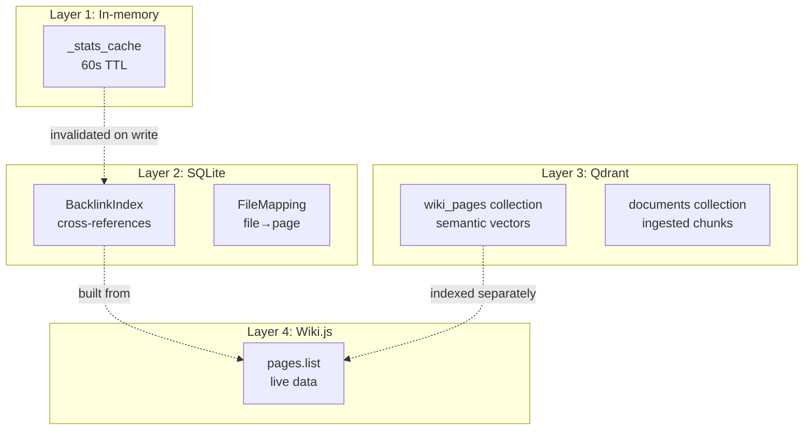

# Caching and Hooks

wiki-js-mcp v3 uses a layered caching approach and fire-and-forget hooks to maintain consistency.

## Cache layers



## In-memory stats cache

[`tools_pages.py` line 1852](../../mcp-servers/wiki-js-mcp/src/wiki_mcp_server/tools_pages.py)

```python
_stats_cache: Dict[str, Any] = {"timestamp": 0.0, "data": None}
_STATS_CACHE_TTL = 60  # seconds

def _invalidate_stats_cache():
    global _stats_cache
    _stats_cache = {"timestamp": 0.0, "data": None}
```

Used by `wikijs_wiki_stats()`. Cache hit when `time.time() - timestamp < 60`. Invalidated on every page create/update/delete via hook.

**Rationale**: Wiki stats are stale-tolerant aggregate data. 60-second cache avoids redundant SQL queries for repeated monitoring calls.

## SQLite caches

### BacklinkIndex

[`db.py` line 36](../../mcp-servers/wiki-js-mcp/src/wiki_mcp_server/db.py)

Denormalized cache of all markdown cross-reference links. Maintained incrementally via `_sync_backlinks_for_page()` after every create/update. Full rebuild via `wikijs_rebuild_backlink_index()`.

**Why cached**: Computing backlinks from raw content requires fetching every page's markdown, extracting links, and resolving paths. At 200 pages, this is a 2–3 second operation. SQLite makes it instant.

### FileMapping

Maps local file paths to Wiki.js page IDs. Used by file integration tools. Not invalidated by page hooks — updated explicitly by `wikijs_link_file_to_page` and `wikijs_sync_file_docs`.

## Qdrant vector store (v3)

**Not a hook-maintained cache.** Unlike v2's `PageVector` SQLite table with automatic upsert on create/update, v3 stores vectors in Qdrant collections:

| Collection | Populated by | Used by |
|------------|--------------|---------|
| `wiki_pages` | `qdrant_upsert_chunks` (manual/batch) | `wikijs_smart_query`, `wikijs_get_affected_pages` |
| `documents` | `ingest_document` (Ingestion Pipeline) | `ingest_search_chunks`, `qdrant_search` |

Indexing wiki pages is an explicit step, not automatic on write.

## Hook system (fire-and-forget)

Hooks run after successful tool operations. They are **fire-and-forget**: failures are logged but do not affect the tool's success response.

### Hook call sites (v3)

| Operation | Hooks | File |
|-----------|-------|------|
| `wikijs_create_page` | `_sync_backlinks_for_page` + `_invalidate_stats_cache` | tools_pages.py |
| `wikijs_update_page` | `_sync_backlinks_for_page` + `_invalidate_stats_cache` | tools_pages.py |
| `wikijs_delete_page` | BacklinkIndex cleanup + `_invalidate_stats_cache` | tools_deletion.py |
| Import tools | `_sync_backlinks_for_page` + `_invalidate_stats_cache` | tools_pages.py |

**Removed in v3**: `_update_page_vector` / `_delete_page_vector` (no PageVector model).

### Hook pattern

```python
# After successful tool operation:
await _sync_backlinks_for_page(page_id, content)
_invalidate_stats_cache()
return json.dumps(result)  # Tool success is independent of hook success
```

If a hook fails, the page was still successfully created/updated. Repair via `wikijs_rebuild_backlink_index()`.

## No caching policy

Several features intentionally avoid caching:

| Feature | Reason |
|---------|--------|
| Tag tools | Single `pages.list` call sufficient at 200 pages (~500ms) |
| Qdrant search | Native KNN; no client-side brute force |
| Smart query | Results are query-dependent; caching would be complex |

**Design principle**: Add caching only when measured performance requires it. At current scale, simplicity wins.
