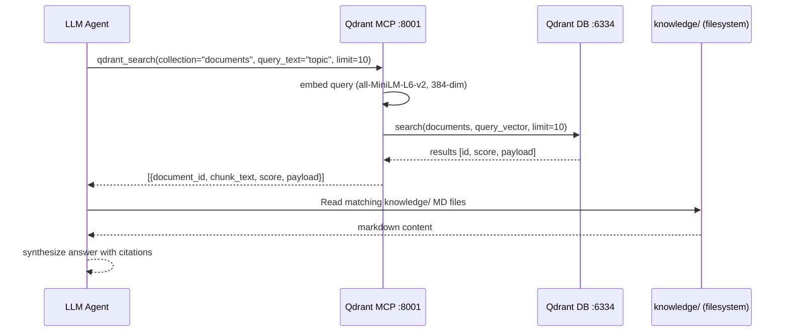
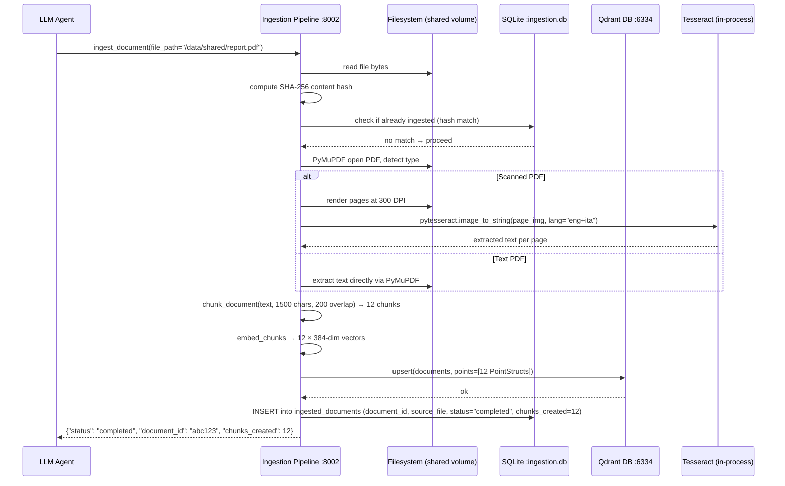
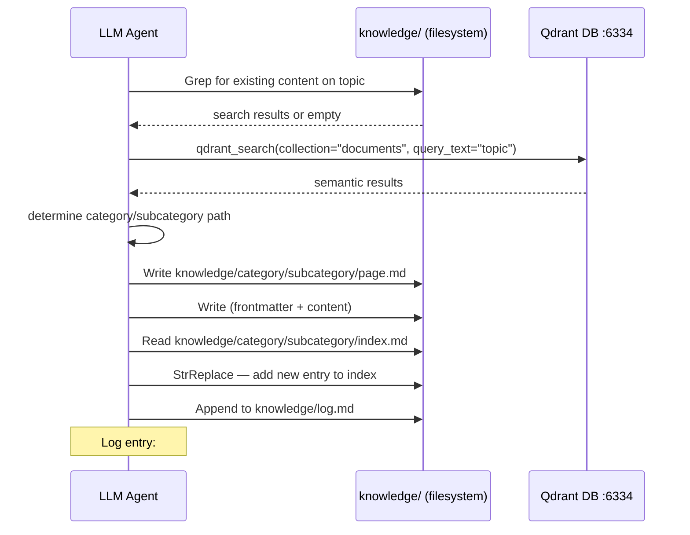
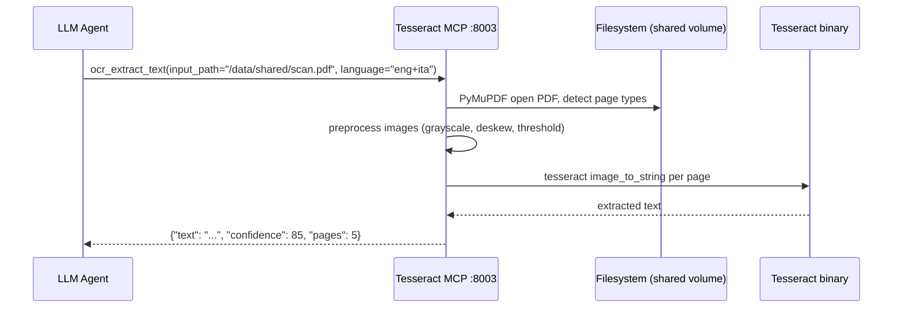

# Data Flow

Request lifecycle diagrams for major operations in pinto-llm-wiki v4. Each section covers a key workflow with a mermaid sequence diagram showing the actors and data transformations involved.

## Semantic Search (`qdrant_search`)

Semantic vector search using Qdrant embeddings, followed by file-system read of matching knowledge files.

## Document Ingestion (`ingest_document`)

Full pipeline: detect file type → extract text → chunk → embed → upsert to Qdrant → track in SQLite.

## Knowledge File Creation (v4 file-system workflow)

Agent creates markdown files directly in the `knowledge/` directory and updates routing indexes.

## OCR Processing (`ocr_extract_text`)

Standalone OCR of scanned documents via Tesseract MCP.

## Related Documents

- [System Overview](system-overview.md) — Container topology and startup order
- [Ingestion Pipeline Design](ingestion-pipeline-design.md) — Pipeline internals
- [LLM Wiki Workflows](../guides/llm-wiki-workflows.md) — Usage patterns
- [Quick Reference](../reference/quick-reference.md) — All tools at a glance
