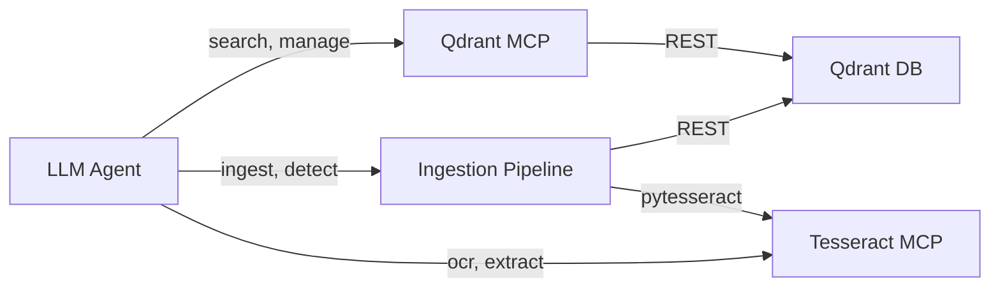

# MCP Server Registry v4

Three independent MCP servers compose the v4 stack. Each has a dedicated purpose with clear boundaries.

## Server Summary

| Server | Port | Tools | Purpose | Dependencies |
|--------|------|-------|---------|-------------|
| **Qdrant MCP** | 8001 | 8 | Vector search, collection management | Qdrant DB |
| **Ingestion Pipeline** | 8002 | 7 | Document processing, chunking, embedding | Qdrant DB + Tesseract |
| **Tesseract MCP** | 8003 | 7 | OCR, document detection | None (standalone) |

## Tool Count by Server

| Server | Collections | Search/Upsert | Documents | OCR | Management | Total |
|--------|------------|--------------|-----------|-----|-----------|-------|
| Qdrant MCP | 4 | 2 | 0 | 0 | 2 | 8 |
| Ingestion Pipeline | 0 | 1 | 4 | 0 | 2 | 7 |
| Tesseract MCP | 0 | 0 | 0 | 5 | 2 | 7 |
| **Total** | **4** | **3** | **4** | **5** | **6** | **22** |

## Cross-Server Communication

Servers do not call each other directly (no MCP-to-MCP calls). Each server connects to its own dependencies independently.

## Port Allocation

| Port | Service | Protocol |
|------|---------|----------|
| 8001 | Qdrant MCP | SSE |
| 8002 | Ingestion Pipeline | SSE |
| 8003 | Tesseract MCP | SSE |
| 6333 | Qdrant DB (gRPC) | gRPC |
| 6334 | Qdrant DB (REST) | HTTP REST |
