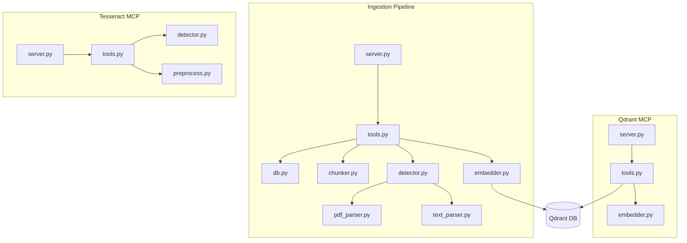

# Modules

v4 distributes Python modules across 3 independent MCP server repositories.

## Repository Map

```
mcp-servers/qdrant-mcp/              # Qdrant MCP (Python)
└── src/qdrant_mcp/
    ├── server.py                    # FastMCP entry point
    ├── tools.py                     # 8 Qdrant tools
    └── embedder.py                  # Lazy SentenceTransformer singleton

mcp-servers/ingestion-pipeline/      # Ingestion Pipeline (Python)
└── src/ingestion_pipeline/
    ├── server.py                    # FastMCP entry point
    ├── tools.py                     # 7 ingestion tools
    ├── db.py                        # SQLAlchemy models (IngestedDocument, etc.)
    ├── chunker.py                   # Section-aware recursive chunking
    ├── embedder.py                  # Lazy SentenceTransformer singleton
    ├── detector.py                  # PyMuPDF file type detection
    ├── pdf_parser.py                # PDF text extraction (hybrid)
    └── text_parser.py               # Text/Markdown parser

mcp-servers/tesseract-mcp/           # Tesseract MCP (Python)
└── src/tesseract_mcp/
    ├── server.py                    # FastMCP entry point
    ├── tools.py                     # 7 OCR tools
    ├── detector.py                  # PyMuPDF text sampling heuristic
    └── preprocess.py                # Grayscale, deskew, denoise, sharpen
```

## Module Dependency Graph



## Module Reference

### Qdrant MCP (`mcp-servers/qdrant-mcp/`)

**`server.py`** — Entry point. Creates FastMCP instance, verifies Qdrant connectivity on startup, registers tools.

**`tools.py`** — 8 Qdrant tools. Collection management (create, list, info, delete), semantic search with payload filters and score threshold, upsert chunks with batch support, delete by filter, scroll pagination.

**`embedder.py`** — Lazy `SentenceTransformer("all-MiniLM-L6-v2")` singleton. `compute_embedding(text)` returns 384-dim vector.

### Ingestion Pipeline (`mcp-servers/ingestion-pipeline/`)

**`server.py`** — Entry point. Creates FastMCP instance, verifies Qdrant and filesystem access, registers tools.

**`tools.py`** — 7 ingestion tools. `ingest_detect_type`, `ingest_document` (full pipeline), `ingest_directory` (batch), `ingest_get_status`/`ingest_list_documents` (monitoring), `ingest_search_chunks` (semantic search), `ingest_delete_document` (cleanup).

**`db.py`** — SQLAlchemy models: `IngestedDocument`, `DocumentChunk`, `PageChunkReference`. Tracks ingestion history for idempotency.

**`chunker.py`** — Section-aware recursive chunking. Targets ~1500 chars per chunk with 200 char overlap.

**`embedder.py`** — Lazy `SentenceTransformer("all-MiniLM-L6-v2")` singleton. Same pattern as Qdrant MCP.

**`detector.py`** — PyMuPDF-based file type detection and OCR requirement classification.

**`pdf_parser.py`** — Hybrid PDF text extraction. Uses PyMuPDF native text for text-based pages, routes scanned pages to pytesseract OCR.

**`text_parser.py`** — Text and Markdown parser. Handles `.md` and `.txt` files with structure-aware parsing.

### Tesseract MCP (`mcp-servers/tesseract-mcp/`)

**`server.py`** — Entry point. Creates FastMCP instance, verifies Tesseract binary and language packs, registers tools.

**`tools.py`** — 7 OCR tools. Text extraction, document type detection, HOCR structured output, per-word confidence scores, language listing, smart document processing, preprocessing pipeline.

**`detector.py`** — PyMuPDF text sampling heuristic. Classifies PDF pages as text-based, scanned, or mixed.

**`preprocess.py`** — OCR preprocessing pipeline. Grayscale, deskew, adaptive thresholding, denoising, sharpening.

## Key Design Patterns

### Embedder Singleton

Both Qdrant MCP and Ingestion Pipeline use the same lazy singleton pattern for `all-MiniLM-L6-v2`:

```python
_embedder = None

def compute_embedding(text: str) -> list[float]:
    global _embedder
    if _embedder is None:
        from sentence_transformers import SentenceTransformer
        _embedder = SentenceTransformer("all-MiniLM-L6-v2")
    return _embedder.encode(text).tolist()
```

### Direct Library Access

Ingestion Pipeline uses `qdrant-client` directly (not via Qdrant MCP SSE) for performance:

```python
from qdrant_client import QdrantClient
client = QdrantClient(url=settings.QDRANT_URL)
client.search(collection_name="documents", query_vector=vec, limit=10)
```

The Qdrant MCP server provides agent-facing vector operations, while internal services use the client library directly.

### DB Session Lifecycle

SQLite access follows the same session pattern:

```python
db = get_db()
try:
    rows = db.query(Model).filter(...).all()
    db.commit()  # Writes only
except Exception:
    db.rollback()
finally:
    db.close()
```
