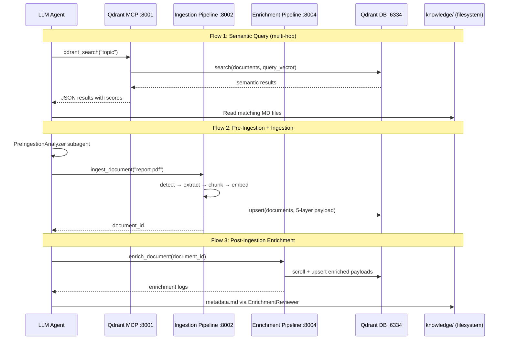

# System Overview v4

pinto-llm-wiki v4 is a **5-container** Docker stack providing 4 independent MCP servers wrapping Qdrant vector search, Tesseract OCR, document ingestion, and post-ingestion enrichment (LangGraph).

## Components

| Component | Container | Role | Port |
|-----------|-----------|------|------|
| **Qdrant DB** | `pinto_llm_qdrant` | Vector database (semantic search) | 6333 (gRPC) / 6334 (REST) |
| **Qdrant MCP** | `pinto_llm_qdrant_mcp` | 8 tools wrapping Qdrant REST API | 8001 |
| **Ingestion Pipeline** | `pinto_llm_ingestion` | Document processing with OCR | 8002 |
| **Tesseract MCP** | `pinto_llm_tesseract_mcp` | Agent-facing OCR tools | 8003 |
| **Enrichment Pipeline** | `pinto_llm_enrichment` | Post-ingestion LangGraph enrichment | 8004 |

The knowledge base lives on the filesystem at `knowledge/`. Ingestion staging: `to_ingest/` bind mount → `/data/shared`.

## Data Flow



## Startup Order

1. `qdrant-db` starts — health check via gRPC :6333
2. `qdrant-mcp` starts after qdrant-db healthy — serves SSE on :8001
3. `ingestion-pipeline` starts after qdrant-db healthy — serves SSE on :8002
4. `tesseract-mcp` starts independently — serves SSE on :8003
5. `enrichment-pipeline` starts after qdrant-db and ingestion-pipeline — serves SSE on :8004

## Volumes

| Volume | Mount | Purpose |
|--------|-------|---------|
| `qdrant_data` | `/qdrant/storage` | Qdrant vector data |
| `qdrant_snapshots` | `/qdrant/snapshots` | Qdrant backup snapshots |
| `shared_data` / `to_ingest/` | `/data/shared` | Host bind mount for ingestion files |
| `ingestion_data` | `/data` | Ingestion SQLite (`ingestion.db`) |
| `enrichment_data` | `/data` | Enrichment SQLite (`enrichment.db`) |

## Network

All 5 containers share the `pinto-llm-net` bridge network. Inter-container communication uses Docker service names: `qdrant-db:6334`, `qdrant-mcp:8001`, etc.

## MCP Transports

Each of the 4 MCP servers uses **SSE** (Server-Sent Events) via FastMCP:

```json
{
  "mcpServers": {
    "qdrant":     { "type": "sse", "url": "http://localhost:8001/sse" },
    "ingestion":  { "type": "sse", "url": "http://localhost:8002/sse" },
    "tesseract":  { "type": "sse", "url": "http://localhost:8003/sse" },
    "enrichment": { "type": "sse", "url": "http://localhost:8004/sse" }
  }
}
```

## What Changed from v3

| Aspect | v3 | v4 |
|--------|-----|-----|
| Containers | 8 | 5 |
| MCP servers | 4 | 4 |
| Total tools | ~65 | 26 |
| Knowledge store | Wiki.js + PostgreSQL | Filesystem `knowledge/` |
| Wiki.js MCP | 43 tools | Removed |
| Page lifecycle | Wiki.js GraphQL CRUD | Filesystem MD read/write |
| Semantic search | Qdrant via wikijs_smart_query (RRF) | Qdrant via qdrant_search |
| Keyword search | wikijs_search_pages | Grep on filesystem |
| Document processing | Same (ingestion pipeline) | Same |
| OCR | Same (Tesseract MCP) | Same |

For more details on the 4-server design, see [Multi-MCP Architecture](multi-mcp-architecture.md).
