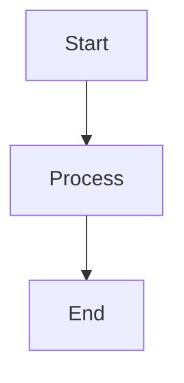

# Agent Orientation v4

How to instruct and orient a new LLM agent to operate the v4 knowledge base.

## What the agent needs to know

### 1. This is a file-system knowledge base

**There is no Wiki.js**. Content lives in the `knowledge/` directory as markdown files organized by category/subcategory. The agent reads and writes `.md` files directly using filesystem tools (Read, Write, StrReplace, Glob, Grep).

### 2. Three MCP servers are available

| Server | Purpose | Tools |
|--------|---------|-------|
| Qdrant MCP (:8001) | Semantic vector search | `qdrant_search`, `qdrant_upsert_chunks`, etc. |
| Ingestion Pipeline (:8002) | Document processing | `ingest_document`, `ingest_search_chunks`, etc. |
| Tesseract MCP (:8003) | OCR | `ocr_extract_text`, `ocr_get_confidence`, etc. |

### 3. The knowledge hierarchy

```
knowledge/
  index.md              # Master map — read this first
  category/
    index.md             # Category listing
    subcategory/
      index.md           # Subcategory listing with file table
      page.md            # Actual content
```

Every directory has an `index.md` that serves as the routing table. The agent must keep these in sync.

### 4. How to search

Priority order:
1. **`qdrant_search`** — semantic search on Qdrant vectors (for ingested documents and indexed content)
2. **`Grep`** — exact keyword search on the filesystem (for non-indexed content)
3. **`Glob`** — find files by name pattern
4. **Navigate `index.md` files** — structured exploration

### 5. How to create content

1. Determine the right category from `knowledge/index.md`
2. Ensure the category/subcategory directories exist (create with `Shell mkdir -p` if needed)
3. Write the `.md` file with complete frontmatter (YAML):
   - `title`, `category`, `tags`, `created`, `updated` — always required
   - `source_type`, `source_url`, `source_name`, `fetched_at` — required for external content
   - `description` — strongly recommended
4. Update the parent `index.md` with the new entry
5. Append to `knowledge/log.md`

### 6. Mermaid diagrams

MD files can include Mermaid diagrams:

````markdown

````

Other diagram types supported: `sequenceDiagram`, `classDiagram`, `stateDiagram`, `erDiagram`, `gantt`, `pie`, `mindmap`, `timeline`.

### 7. Source attribution

Every page created from external content MUST have source attribution in the frontmatter. See `.cursor/rules/35-web-ingestion.mdc` for the complete format.

### 8. Operational logging

- Session operations are logged in `agent_tmp/` (see `.cursor/rules/25-agent-logging.mdc`)
- Knowledge changes are logged in `knowledge/log.md` (append-only)
- Index consistency is critical — always update `index.md` when adding/removing files
