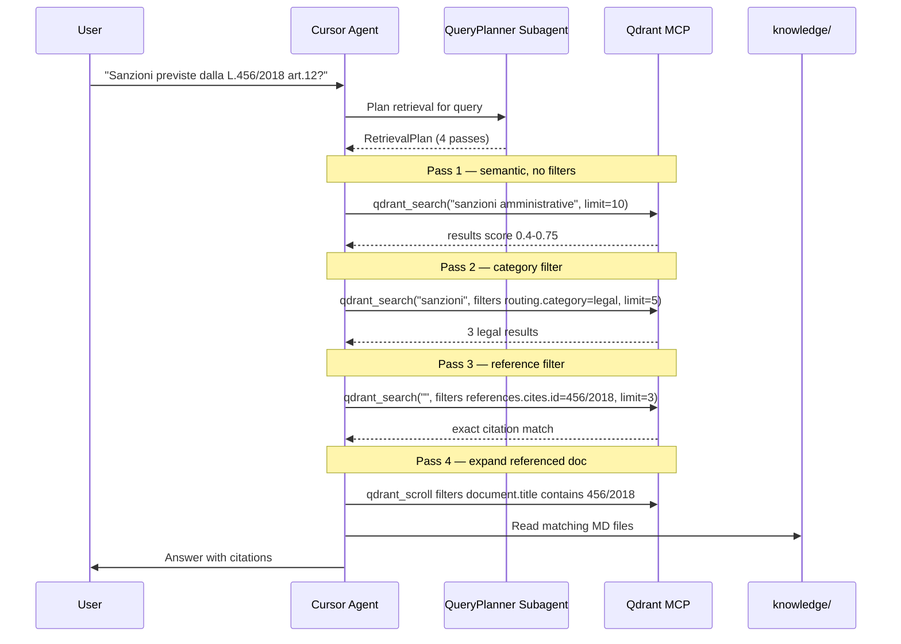

# Multi-Hop Retrieval

Strategy for complex queries requiring multiple Qdrant searches before synthesizing an answer.

**Rule:** Never answer after a single `qdrant_search`. Minimum 2 passes for complex queries.

## Sequence Diagram



## Step-by-Step

### 1. ANALYZE

Extract from the user query:
- Semantic topic ("sanzioni privacy")
- Explicit references ("L.456/2018 art.12")
- Named entities ("Garante Privacy", "GDPR")

Spawn **QueryPlanner** subagent for complex queries.

### 2. FIRST PASS — Exploratory

```
qdrant_search(collection="documents", query_text="<topic>", limit=10)
```

No filters. Review scores:
- Median > 0.5: good semantic match
- Median < 0.4: try keyword fallback with Grep

### 3. SECOND PASS — Filtered

From Pass 1 results, identify dominant `routing.category` and `routing.language`:

```
qdrant_search(
  collection="documents",
  query_text="<refined topic>",
  filters={"must": [{"key": "routing.category", "match": {"value": "legal"}}]},
  limit=5
)
```

### 4. REFERENCE PASS — Explicit citations

If query mentions a law/code:

```
qdrant_search(
  collection="documents",
  query_text="<topic>",
  filters={"must": [{"key": "references.cites.id", "match": {"value": "456/2018"}}]},
  limit=5
)
```

### 5. EXPAND — Follow cross-references

For each `references.cites` in top results, fetch the referenced document:

```
qdrant_scroll(collection="documents", filters={document_id: "<ref_doc_id>"})
```

### 6. KEYWORD FALLBACK

If semantic scores remain weak:

```
Grep "exact phrase" in knowledge/**/*.md
```

### 7. SYNTHESIZE

Combine all passes, deduplicate by `document_id` + `chunk_index`, cite source files.

## When to Stop

| Condition | Action |
|-----------|--------|
| Score > 0.7 on Pass 1 | Skip Pass 2, go to synthesis |
| Reference found on Pass 3 | Expand and synthesize |
| All scores < 0.3 | Grep fallback, report gap to user |

## Related

- [Collections Routing](../../knowledge/collections-routing.md)
- [Subagents — QueryPlanner](subagents.md)
- [Payload Schema](../reference/payload-schema.md)
