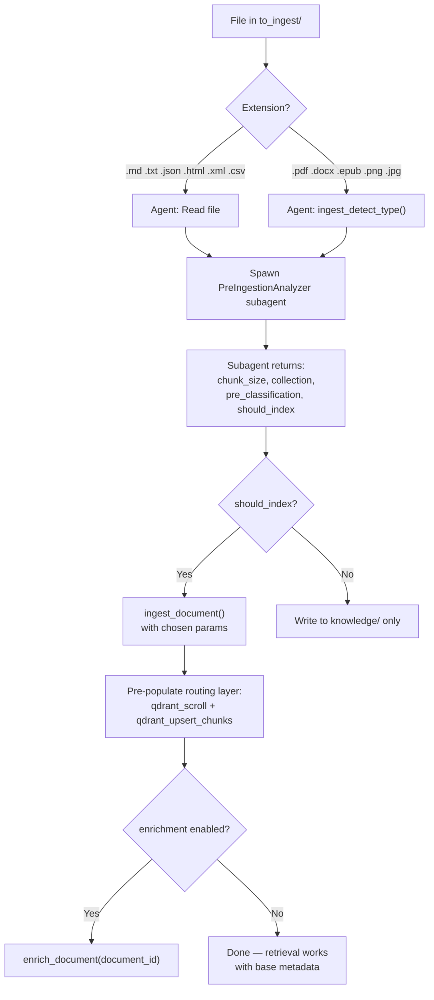

# Pre-Ingestion Analysis

The **Cursor agent** (not the enrichment container) analyzes documents **before** ingestion to choose optimal parameters and pre-populate metadata.

## Decision Flow



## Chunk Size Recommendations

| Document type | `chunk_size` | `chunk_overlap` | Reason |
|---------------|-------------|-----------------|--------|
| Legal (articles) | 1000 | 150 | Articles are dense, cross-referenced |
| General prose | 1500 | 200 | Default pipeline setting |
| Code / API docs | 800 | 100 | Smaller units for precise retrieval |
| Logs / data dumps | 2000 | 300 | Larger context windows |

## Pre-Classification Fields

After ingestion, pre-populate Layer 2 via `qdrant_upsert_chunks`:

```json
{
  "routing": {
    "category": "legal",
    "subcategory": "administrative-law",
    "language": "it",
    "source_type": "file"
  }
}
```

This improves retrieval **even when enrichment is disabled**.

## Extension Routing

| Extensions | Action |
|------------|--------|
| `.md`, `.txt`, `.json`, `.html`, `.xml`, `.csv` | `Read` → analyze → optional `ingest_document` |
| `.pdf`, `.docx`, `.epub`, `.png`, `.jpg` | `ingest_detect_type` → `ingest_document` |

## Subagent

See [Subagents](subagents.md) — **PreIngestionAnalyzer** for full I/O contract.

## Related

- [LLM Wiki Workflows](llm-wiki-workflows.md)
- [Payload Schema](../reference/payload-schema.md)
- [Enrichment Config](../../knowledge/enrichment-config.md)
