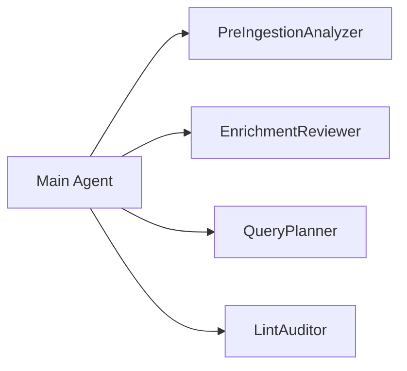

# Subagents — Cursor Agent Delegation

Four specialized subagents handle complex workflows. The main agent spawns them via the Task tool.

## Architecture



---

## 1. PreIngestionAnalyzer

**Trigger:** New file in `to_ingest/`

**Input:**
- `file_path`, `file_extension`
- `detect_type_result` (if binary format)

**Output:**
```json
{
  "doc_type": "law | paper | manual | report | readme | log | data | unknown",
  "suggested_chunk_size": 1500,
  "suggested_chunk_overlap": 200,
  "suggested_collection": "documents",
  "pre_classification": {
    "category": "legal",
    "subcategory": "administrative-law",
    "language": "it",
    "title": "Legge 123/2020",
    "doc_type": "law"
  },
  "should_index": true,
  "should_ocr": false,
  "analysis_notes": "Structured legal text with article numbering"
}
```

**Actions:**
1. Read file (text) or review `ingest_detect_type` output (binary)
2. Analyze structure, length, domain, references
3. Return ingestion parameters for main agent

See [Pre-Ingestion Analysis](pre-ingestion-analysis.md).

---

## 2. EnrichmentReviewer

**Trigger:** After `enrich_get_status()` returns `completed`

**Input:** `document_id`, enrichment log entries

**Output:** `metadata.md` written to `knowledge/ingested/YYYY-MM-DD-slug/`

**Actions:**
1. Read enrichment logs via `enrich_get_status(document_id)`
2. Validate classification quality and references found
3. Write `metadata.md` using [Metadata Template](../reference/metadata-template.md)
4. Update `knowledge/ingested/index.md`
5. Append to `knowledge/log.md`

---

## 3. QueryPlanner

**Trigger:** Complex user query (multi-domain, legal references, cross-reference)

**Input:** `user_query_text`

**Output:** RetrievalPlan — ordered list of `qdrant_search` calls

**Example plan:**
```
Pass 1: qdrant_search("sanzioni privacy", limit=10) — no filters
Pass 2: qdrant_search("sanzioni amministrative", filters={routing.category: legal}, limit=5)
Pass 3: qdrant_search("", filters={references.cites.id: "456/2018"}, limit=3)
Pass 4: Grep "Art. 12" in knowledge/ — keyword fallback
```

See [Multi-Hop Retrieval](multi-hop-retrieval.md).

---

## 4. LintAuditor

**Trigger:** On-demand or periodic health check

**Input:** None (scans `knowledge/`)

**Output:** LintReport with issues and fixes

**Checks:**
1. Frontmatter completeness (`title`, `category`, `created`, `updated`)
2. Index consistency (files listed in `index.md` exist and vice versa)
3. Broken relative links
4. Qdrant payload Layer 2 populated for ingested documents

---

## Related

- [LLM Wiki Workflows](llm-wiki-workflows.md)
- [Agent Orientation](agent-orientation.md)
- [Collections Routing](../../knowledge/collections-routing.md)
