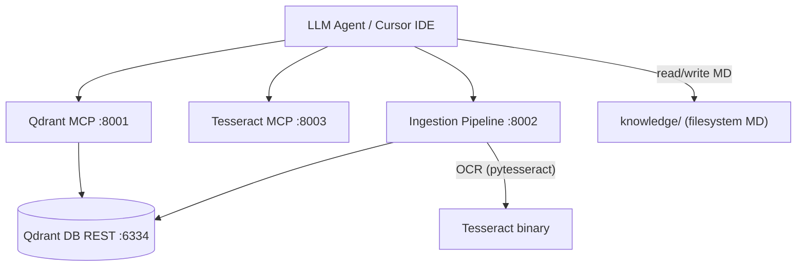

# wiki-js-mcp v4 Documentation

Multi-MCP server ecosystem with Qdrant vector search, Tesseract OCR, and document ingestion pipeline. **Filesystem-based knowledge base** replacing Wiki.js.

**22 tools across 3 MCP servers in 4 Docker containers.**

## Quick Navigation

| Section | Description | Best for |
|---------|-------------|----------|
| [Architecture](architecture/index.md) | 4-container stack, Qdrant, MCP design | Understanding system design |
| [MCP Servers](mcp-servers/index.md) | Per-server tool catalogs and configuration | Looking up a specific server |
| [Guides](guides/index.md) | Quickstart, workflows, stack lifecycle, Docker operations | How-to instructions |
| [Stack Lifecycle](guides/stack-lifecycle.md) | Build, start, stop, rebuild the 4-container stack | Before operating MCP tools |
| [Tool Catalog](reference/tool-catalog.md) | All 22 tools with signatures | Looking up tool parameters |
| [Reference](reference/index.md) | Configuration, testing, error catalog | Technical reference |

## System at a Glance

## MCP Server Map

| Server | Container | Port | Tools |
|--------|-----------|------|-------|
| Qdrant MCP | `wikijs_qdrant_mcp` | 8001 | 8 |
| Tesseract MCP | `wikijs_tesseract_mcp` | 8003 | 7 |
| Ingestion Pipeline | `wikijs_ingestion` | 8002 | 7 |

## What Changed from v3

| Aspect | v3 | v4 |
|--------|-----|-----|
| Containers | 8 | 4 |
| MCP servers | 4 | 3 |
| Total tools | ~65 | 22 |
| Knowledge store | Wiki.js + PostgreSQL | Filesystem `knowledge/` |
| Wiki.js MCP | 43 tools | Removed |

## Reading Order

### For human operators

1. [Quickstart](guides/quickstart.md) — Get the 4-container stack running
2. [Agent Orientation](guides/agent-orientation.md) — How to instruct the LLM agent
3. [File Paths and Volumes](guides/file-paths-and-volumes.md) — Where files go, how to copy them
4. [Docker Operations](guides/docker-operations.md) — Build, test, debug commands
5. [Troubleshooting](guides/troubleshooting.md) — Fix common problems

### For LLM agents

1. [Quick Reference](reference/quick-reference.md) — Start here: all tools, knowledge structure, workflows, and ports on one page
2. [Stack Lifecycle Guide](guides/stack-lifecycle.md) — Build, start, stop, rebuild; verify stack before operating
3. [System Overview](architecture/system-overview.md) — The 4 containers, how they connect
4. [LLM Wiki Workflows](guides/llm-wiki-workflows.md) — Core operating patterns (Ingest, Query, Lint, OCR, Web)
5. [Tool Catalog](reference/tool-catalog.md) — All 22 tools with full signatures
6. [Error Catalog](reference/error-catalog.md) — Common errors and solutions
