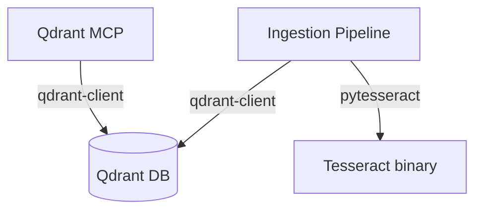

# MCP Server Documentation v4

Three independent MCP servers forming the wiki-js-mcp v4 ecosystem. Wiki.js MCP was removed in v4.

## Server Overview

| Server | Document | Tools | Delegates To |
|--------|----------|-------|--------------|
| Qdrant MCP | [qdrant-mcp.md](qdrant-mcp.md) | 8 | Qdrant DB |
| Tesseract MCP | [tesseract-mcp.md](tesseract-mcp.md) | 7 | — |
| Ingestion Pipeline | [ingestion-pipeline-mcp.md](ingestion-pipeline-mcp.md) | 7 | Qdrant DB, Tesseract |

## Communication Map

## Design Philosophy

- **Separation of concerns**: Each MCP server owns one domain
- **Independent scaling**: Servers can be restarted independently
- **MCP-native**: Standard FastMCP SSE transport for Cursor integration
- **Direct communication**: Intra-service calls use native libraries (qdrant-client, pytesseract), not MCP

## Related Sections

- [Architecture](../architecture/index.md) — System design and server registry
- [Tool Catalog](../reference/tool-catalog.md) — All 22 tools with full signatures
- [Guides](../guides/index.md) — Workflows and operations
