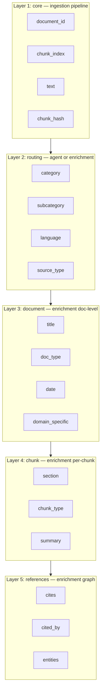

# Payload Schema v4 — 5-Layer Qdrant Payload

Every ingested chunk in Qdrant uses a nested 5-layer payload. Layers 1–2 are populated at ingestion; layers 3–5 are filled by the Cursor agent (pre-ingestion) and/or the enrichment pipeline (post-ingestion, port 8004).

## Layer Overview



## Layer Definitions

| Layer | Populated by | Required at ingest | Required for good retrieval |
|-------|--------------|-------------------|----------------------------|
| `core` | Ingestion pipeline | Yes | Yes |
| `routing` | Agent pre-ingestion or enrichment | Placeholders (`null`) | Yes |
| `document` | Enrichment | Empty `{}` | Recommended |
| `chunk` | Enrichment (heuristics) | Empty `{}` | Optional |
| `references` | Enrichment | Empty `{}` | For legal/cross-ref docs |

## Full Example — Italian Law

```json
{
  "core": {
    "document_id": "a1b2c3d4e5f6a7b8",
    "chunk_index": 5,
    "text": "Art. 15. Le sanzioni amministrative...",
    "chunk_hash": "9f86d081884c7d65"
  },
  "routing": {
    "category": "legal",
    "subcategory": "administrative-law",
    "language": "it",
    "source_type": "file"
  },
  "document": {
    "title": "Legge 123/2020",
    "doc_type": "law",
    "date": "2020-03-15",
    "domain_specific": {
      "law_id": "123/2020",
      "jurisdiction": "Italy"
    }
  },
  "chunk": {
    "section": "Capo II - Sanzioni",
    "chunk_type": "article_body",
    "summary": "Sanzioni amministrative per violazione dati personali"
  },
  "references": {
    "cites": [
      {"type": "law", "id": "456/2018", "article": "Art.12", "comma": "c.3"}
    ],
    "cited_by": [],
    "entities": ["sanzioni amministrative", "Garante Privacy"]
  },
  "document_id": "a1b2c3d4e5f6a7b8",
  "chunk_index": 5,
  "source_file": "/data/shared/legge-123.pdf",
  "file_type": "text_pdf",
  "text": "Art. 15. Le sanzioni amministrative...",
  "content_hash": "9f86d081884c7d65",
  "ingested_at": "2026-05-31T00:00:00+00:00"
}
```

## Legacy Flat Fields

Flat fields (`document_id`, `chunk_index`, `text`, etc.) duplicate nested data for backward compatibility with existing filters and `ingest_search_chunks`. Always keep them in sync when updating payloads.

## Filter Examples

```json
{"must": [{"key": "routing.category", "match": {"value": "legal"}}]}
{"must": [{"key": "routing.language", "match": {"value": "it"}}]}
{"must": [{"key": "document.doc_type", "match": {"value": "law"}}]}
```

See [Collections Routing](../../knowledge/collections-routing.md) for retrieval strategy.

## Related Documents

- [Ingestion Pipeline Design](../architecture/ingestion-pipeline-design.md)
- [Metadata Template](metadata-template.md)
- [Multi-Hop Retrieval](../guides/multi-hop-retrieval.md)
- [Collections Routing](../../knowledge/collections-routing.md)
