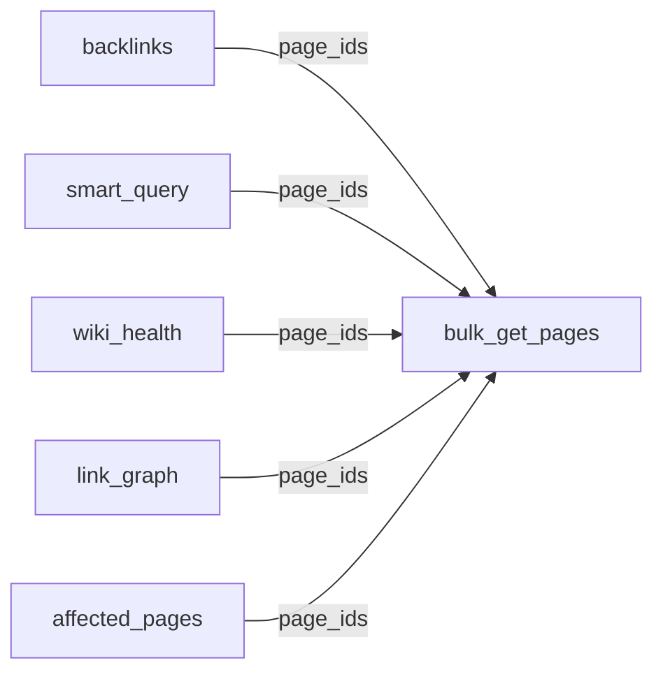

# wikijs_bulk_get_pages — Full Implementation Plan

---

- **Status**: `completed`
- **Priority**: P1 — Blocker for basic LLM Wiki workflow
- **Dependencies**: None

## Purpose

Read N pages (full content) in a single MCP tool call. Replaces the pattern of making N separate `wikijs_get_page` calls, each a full round trip through MCP -> GraphQL -> Wiki.js.

Without this tool, an ingestion operation touching 10-15 pages would require 10-15 round trips. At scale (200+ pages), any operation (ingest, query, lint) becomes painfully slow.

## Design decisions

### Approach: `asyncio.gather` of N `pages.single` queries

**Chosen**: Fire N parallel `pages.single(id: $id)` queries using `asyncio.gather`.

**Alternatives considered and rejected**:

- **Single bulk GraphQL query**: Wiki.js GraphQL API has no `pages.list` with ID filtering. Constructing a query with dynamic aliases (e.g., `p1: pages { single(id: 1) {...} } p2: pages { single(id: 2) {...} }`) is fragile for 50 pages, complicates error handling, and breaks the retry logic in `WikiJSClient.graphql_request`.
- **Sequential loop**: Defeats the purpose — same round-trip count as calling `wikijs_get_page` N times individually.

**Why `asyncio.gather` is the right choice**:
- Reuses the exact `GET_PAGE_QUERY` GraphQL pattern from `wikijs_get_page` — zero new query logic
- `httpx.AsyncClient` connection pooling handles concurrency gracefully
- For 10-15 pages (typical ingest), responses arrive near-simultaneously
- Partial failures are trivial: `return_exceptions=True` captures per-page errors without aborting the batch
- Zero risk: this pattern is already battle-tested in the existing codebase

### Input: `page_ids: List[int]` only — no path support for v1

**Chosen**: Single parameter `page_ids: List[int]`. No `page_paths` parameter in v1.

**Rationale from the full roadmap**:

Every downstream tool that will consume `bulk_get_pages` passes page IDs:

| Downstream tool | What it returns | How it feeds bulk_get_pages |
|---|---|---|
| `backlinks` (P1) | List of page IDs that link to a target | Page IDs -> bulk read their content |
| `smart_query` (P2) | Ranked results with `pageId` | Page IDs -> bulk read for summaries |
| `wiki_health` (P3) | Lists of orphan/stale page IDs | Page IDs -> bulk inspect affected pages |
| `link_graph` (P2) | Graph nodes keyed by page ID | Page IDs -> bulk read linked pages |
| `affected_pages` (P4) | Impacted page IDs | Page IDs -> bulk read for impact analysis |

Path-based lookup is a human entry point, not an agent-to-agent flow. The existing `wikijs_get_page(slug=...)` already serves that purpose for single pages. If path support is needed later, it can be added as a v2 enhancement without breaking the API.

### Error handling: partial success

**Chosen**: Return valid results for successful pages alongside error entries for failed ones. Never fail the entire batch because one page is missing.

**Format**:

```json
{
  "results": [
    {"pageId": 1, "title": "...", "content": "...", "path": "...", "lastModified": "...", "tags": [...], "description": "..."},
    {"pageId": 2, "title": "...", "content": "...", ...}
  ],
  "errors": [
    {"pageId": 99, "error": "Page not found"}
  ],
  "summary": {
    "requested": 10,
    "returned": 9,
    "failed": 1
  }
}
```

**Why partial and not all-or-nothing**:

The LLM Wiki pattern is inherently fault-tolerant. An agent ingesting a source that affects 12 entity pages shouldn't lose all work because page 7 was deleted by a human user. With partial success, the agent:
- Processes valid pages normally
- For the failed ID: decides whether to recreate, report, or skip
- Completes the ingest without interruption

The `summary` field enables calling code (future tools like `smart_query` that use `bulk_get_pages` internally) to do conditional logic without parsing the results array.

### `include_content` default: `True`

**Chosen**: `include_content=True` by default.

**Why**: This tool is called `bulk_get_pages`, not `bulk_get_page_metadata`. Its primary purpose is reading page content in batch — that's what the LLM Wiki pattern needs most. Metadata-only batch reading belongs to `page_stats` (P1), which will return richer metadata (word count, inbound/outbound links, freshness) than this tool's metadata subset.

When `include_content=False`, the tool strips the `content` field from each result but still returns `pageId`, `title`, `path`, `lastModified`, `tags`, `description`. This escape hatch exists for the rare case where an agent needs batch metadata before `page_stats` is implemented, but it's not the default path.

### Batch cap: 50 pages, hardcoded

**Chosen**: Reject calls with more than 50 page IDs with a clear error message.

**Why 50**:
- Typical ingest: 10-15 pages (well within cap)
- Complex query: 20-30 pages
- Targeted lint: 30-40 pages
- Above 50, the agent is likely doing something wrong — it should use `wiki_health` for dashboard-style checks or `smart_query` for relevance-ranked retrieval
- 50 concurrent HTTP requests to Wiki.js is reasonable for the httpx connection pool

Hardcoded for v1. If a deployment needs a different limit, expose via `MCP_BULK_GET_MAX_PAGES` env variable in a future iteration.

## Implementation steps

### 1. Extract `GET_PAGE_QUERY` as a module-level constant

The `wikijs_get_page` function defines a GraphQL query for fetching a single page by ID. Extract this into a module-level constant `_GET_PAGE_BY_ID_QUERY` so both `wikijs_get_page` and `wikijs_bulk_get_pages` can share it without duplication.

File: `mcp-server/src/wiki_mcp_server/tools_pages.py`

```python
_GET_PAGE_BY_ID_QUERY = """
query($id: Int!) {
    pages {
        single(id: $id) {
            id
            path
            title
            content
            description
            isPrivate
            isPublished
            locale
            createdAt
            updatedAt
            tags {
                tag
            }
        }
    }
}
"""
```

### 2. Add `wikijs_bulk_get_pages` tool function

File: `mcp-server/src/wiki_mcp_server/tools_pages.py`

```python
BULK_GET_MAX_PAGES = 50

@mcp.tool()
async def wikijs_bulk_get_pages(page_ids: List[int], include_content: bool = True) -> str:
    """... (docstring) ..."""
```

Logic:

1. Validate input: if `len(page_ids) > BULK_GET_MAX_PAGES`, return error immediately
2. If `len(page_ids) == 0`, return error immediately
3. Deduplicate `page_ids` (no point fetching the same page twice)
4. `await wikijs.authenticate()`
5. Build tasks: for each `pid` in deduplicated list, `wikijs.graphql_request(_GET_PAGE_BY_ID_QUERY, {"id": pid})`
6. `await asyncio.gather(*tasks, return_exceptions=True)`
7. Iterate results:
   - If `isinstance(result, Exception)`: add to errors with page ID and `str(result)`
   - If GraphQL returned no `pages.single`: add to errors with "Page not found"
   - Otherwise: extract fields, optionally strip content if `include_content=False`, add to results
8. Build summary
9. Log: INFO `"bulk_get_pages: requested N, returned M, failed K"`; WARNING for each failed ID
10. Return `json.dumps({"results": results, "errors": errors, "summary": summary})`

### 3. Update `wikijs_get_page` to use the shared query

Replace the inline `query` variable in `wikijs_get_page` with `_GET_PAGE_BY_ID_QUERY`. The behavior of `wikijs_get_page` must not change — this is a pure refactor.

### 4. Add `import asyncio`

Add `import asyncio` to the module imports.

### 5. Update documentation

- `docs/MCP_TOOL_CATALOG.md`: add `wikijs_bulk_get_pages` entry under "Page management" (count moves from 6 to 7)
- `plans/llm-wiki/STATUS.md`: change status from `pending` to `planned`

## Logging specification

Logging is critical for agent observability. The tool must log in a way the agent can understand from log output.

### Log lines

| Event | Level | Message format |
|-------|-------|---------------|
| Tool invoked | `INFO` | `bulk_get_pages called with N IDs, include_content={include_content}` |
| Cap exceeded | `WARNING` | `bulk_get_pages cap exceeded: N requested, max {BULK_GET_MAX_PAGES}` |
| Empty input | `WARNING` | `bulk_get_pages called with empty page_ids` |
| Batch dispatched | `DEBUG` | `bulk_get_pages firing N parallel queries` |
| Individual failure | `WARNING` | `bulk_get_pages failed to fetch page {pid}: {error_message}` |
| Batch completed | `INFO` | `bulk_get_pages completed: requested={N}, returned={M}, failed={K}, failed_ids=[...]` |
| Unexpected error | `ERROR` | `bulk_get_pages unexpected error: {exception}` |

The INFO-level completion message is the most important — it gives the agent a single-line summary of what happened without requiring complex JSON parsing of the return value.

## Scale considerations

### Handles 200+ pages

- **Cap protects the server**: 50 concurrent requests max, preventing accidental overload
- **Connection pooling**: httpx reuses connections, so 50 parallel requests are efficient
- **Deduplication**: prevents redundant fetches if the agent passes the same ID twice
- **Token budget**: the agent must be mindful of context window when reading 50 full pages concurrently. The cap and `include_content=False` escape hatch help manage this

### Degradation behavior

| Scenario | Behavior |
|----------|----------|
| 1-5 pages | Instant, minimal overhead vs single get |
| 10-15 pages (typical ingest) | Near-instant, all responses arrive in ~1 round trip |
| 50 pages (max) | All 50 concurrent. Wiki.js may slow slightly but should handle it |
| 51+ pages | Immediate error message, no requests sent |
| Wiki.js down | All N pages fail with connection error; each logged individually |

### What degrades at 500+ pages

At very large scale, the agent should rely on `smart_query` (relevance-ranked retrieval) and `wiki_health` (dashboard) rather than reading raw pages in bulk. `bulk_get_pages` remains useful for targeted reads (e.g., "give me the 5 pages most linked to this concept") but is not the primary navigation tool at extreme scale.

## Integration points

### How downstream tools consume `bulk_get_pages`



- **`backlinks` (P1)**: receives a list of page IDs linking to a target; calls `bulk_get_pages` to read their content for context
- **`smart_query` (P2)**: relevance-ranked results include `pageId`; calls `bulk_get_pages` with `include_content=True` to build summaries
- **`wiki_health` (P3)**: orphan/stale/untagged lists include page IDs; calls `bulk_get_pages` for inspection
- **`link_graph` (P2)**: graph neighbors are page IDs; calls `bulk_get_pages` to expand the subgraph
- **`affected_pages` (P4)**: impact analysis returns page IDs; calls `bulk_get_pages` to load pages for update

### How the LLM Wiki agent uses it directly

```
# Ingest workflow (agent-side)
index_id = find_page("index.md")
index_content = bulk_get_pages([index_id])
# Parse index, identify affected entity pages: [42, 55, 67]
entities = bulk_get_pages([42, 55, 67])
# Update entities, append to log
```

## Acceptance criteria

- [x] Can fetch 10 pages by ID in a single tool call
- [x] Returns `results` array with all expected fields (`pageId`, `title`, `content`, `path`, `lastModified`, `tags`, `description`)
- [x] Handles missing page IDs gracefully: valid pages in `results`, missing ID in `errors` with explanation
- [x] `summary` contains accurate `requested`, `returned`, `failed` counts
- [x] Deduplicates input: requesting the same ID twice returns it once in results
- [x] Rejects >50 IDs with a clear error message and no HTTP requests
- [x] Rejects empty input with a clear error message
- [x] `include_content=False` strips the `content` field from each result
- [x] Logs completion at INFO with counts and failed IDs
- [x] Logs individual failures at WARNING
- [x] Existing `wikijs_get_page` behavior is unchanged
- [x] `MCP_TOOL_CATALOG.md` updated with new tool entry
- [x] Verified through Browser DevTools MCP against a running wiki

## Test results (2026-05-21)

All tests executed inside the Docker `mcp-server` container against a live Wiki.js instance with 17 seeded pages.

| Test | Result | Notes |
|------|--------|-------|
| happy_path | PASS | 4 valid IDs -> 4 results, all fields present |
| partial_failure | PASS | 2 valid + 2 invalid IDs -> 2 results + 2 errors with correct page IDs |
| no_content | PASS | `include_content=False` strips `content` from all results |
| dedup | PASS | [7,7,8,8,8] -> 5 requested, 2 unique returned |
| cap_exceeded | PASS | 51 IDs -> rejected with clear message, no HTTP requests |
| empty_input | PASS | [] -> rejected with "page_ids must not be empty" |

**Docker**: Image rebuilt and container restarted successfully.
**Browser verification**: Navigated to `http://localhost:3000/docs/overview` — page content matches what `bulk_get_pages` returns.

## Verification plan

1. Start the stack: `docker compose up -d wiki db setup mcp-server`
2. Seed test data: `python3 mcp-server/scripts/seed_wiki_docs.py` (creates 17+ pages)
3. Confirm connectivity: call `wikijs_connection_status`
4. **Happy path**: call `wikijs_bulk_get_pages(page_ids=[1,2,3,4,5])` — 5 pages returned with content
5. **Partial failure**: call with a mix of valid and invalid IDs — verify results array has valid pages, errors array has the invalid one
6. **Cap rejection**: call with 60 IDs — verify immediate error, no requests
7. **Empty input**: call with `page_ids=[]` — verify error message
8. **Dedup**: call with `page_ids=[1,1,2,2,3,3]` — verify 3 results, not 6
9. Navigate to wiki in browser, verify the pages read by bulk_get match what's displayed
