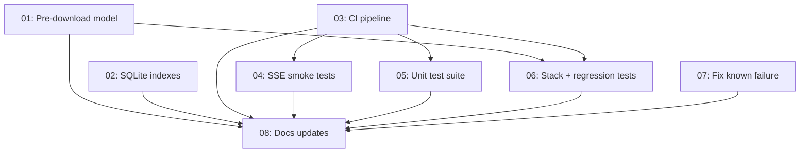

# v3 Completion Plan

Self-contained plan for completing wiki-js-mcp v3. Every file encodes current state — read from filesystem, not memory.

**Current state: 8/8 tasks complete** 🎉

## How to Use

1. Start here. Read this file first.
2. Find the first task with `status: pending` that has no blocked dependencies.
3. Read that task's MD file in `tasks/` — it contains everything needed.
4. Execute the task. When done, update:
   - The task's MD file (status, decisions, notes)
   - `roadmap.md` (change log, status table)
   - `decisions.md` (if design decisions were made)
   - `doc_v3/` documentation (as specified in task's "Documentation Updates")
5. Repeat.

## Task Overview

| ID | Task | Status | Priority | Effort | Depends On | Blocks |
|----|------|--------|----------|--------|------------|--------|
| 01 | [Pre-download embedding model](tasks/01-pre-download-model.md) | completed | P1 | Small | none | 06 |
| 02 | [SQLite indexes on BacklinkIndex](tasks/02-sqlite-indexes.md) | completed | P2 | Small | none | none |
| 03 | [CI pipeline (GitHub Actions)](tasks/03-ci-pipeline.md) | completed | P1 | Small | none | 04, 05, 06 |
| 04 | [SSE smoke tests for all 65 tools](tasks/04-sse-smoke-tests.md) | completed | P0 | Medium | 03 | none |
| 05 | [Unit test suite (~80 tests)](tasks/05-unit-test-suite.md) | completed | P0 | Large | 03 | none |
| 06 | [Stack + regression tests](tasks/06-stack-regression-tests.md) | completed | P1 | Medium | 01, 03 | none |
| 07 | [Fix known test failure](tasks/07-fix-known-failure.md) | completed | P2 | Small | none | none |
| 08 | [Documentation updates](tasks/08-docs-updates.md) | completed | P1 | Ongoing | after each task | none |

**Priority legend:** P0 = unblocks further work, P1 = important quick win, P2 = nice to have

## Next Unblocked Task

All 8 tasks complete! The plan has been fully executed.

## Quick Links

- [Roadmap](roadmap.md) — master status tracker with dependency graph and change log
- [Decisions](decisions.md) — design/architecture decision log
- [Prompt for new conversations](prompt.md) — paste this to resume work

## Dependency Graph

## Related Documentation

- [doc_v3/index.md](../../doc_v3/index.md) — v3 documentation root
- [doc_v3/improvements/index.md](../../doc_v3/improvements/index.md) — source of these tasks
- [doc_v3/reference/test-results.md](../../doc_v3/reference/test-results.md) — current test status
