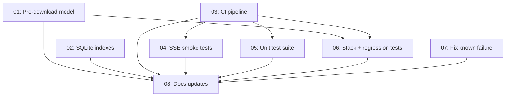

# Roadmap — v3 Completion

Master status tracker. Updated after every task.

## Progress

**8/8 tasks completed** 🎉

## Status Table

| ID | Task | Status | Priority | Effort | Depends On | Blocks | Subagent |
|----|------|--------|----------|--------|------------|--------|----------|
| 01 | Pre-download embedding model | completed | P1 | Small | none | 06 | — |
| 02 | SQLite indexes on BacklinkIndex | completed | P2 | Small | none | none | — |
| 03 | CI pipeline (GitHub Actions) | completed | P1 | Small | none | 04, 05, 06 | — |
| 04 | SSE smoke tests | completed | P0 | Medium | 03 | none | — |
| 05 | Unit test suite | completed | P0 | Large | 03 | none | — |
| 06 | Stack + regression tests | completed | P1 | Medium | 01, 03 | none | — |
| 07 | Fix known test failure | completed | P2 | Small | none | none | — |
| 08 | Documentation updates | completed | P1 | Ongoing | each task | none | — |

## Dependency Graph

## Parallel Execution Strategy

- **Wave 1** (no deps, can run in parallel): 01, 02, 03, 07
- **Wave 2** (after 03): 04, 05
- **Wave 3** (after 01 + 03): 06
- **Continuous** (after each task): 08

## Change Log

| Date | Task | Change |
|------|------|--------|
| 2026-05-24 | 08 | Task 08 completed. All documentation files updated. Final pass complete. |
| 2026-05-24 | 06 | Task 06 completed (Wave 3). Stack + regression tests verified and fixed (3 bugs corrected). |
| 2026-05-24 | 04, 05 | Tasks 04, 05 completed (Wave 2). SSE smoke tests (37 tests across 4 servers), unit test suite (~109 tests across 4 modules). |
| 2026-05-24 | 01, 02, 03, 07 | Tasks 01, 02, 03, 07 completed (Wave 1). Pre-download model in both Dockerfiles, BacklinkIndex SQLite indexes added, CI workflow verified, known test failure fixed. |
| 2026-05-24 | — | Plan created. All 8 tasks initialized with status `pending`. |

## Decisions

See [decisions.md](decisions.md) for design and architecture decisions made during implementation.
