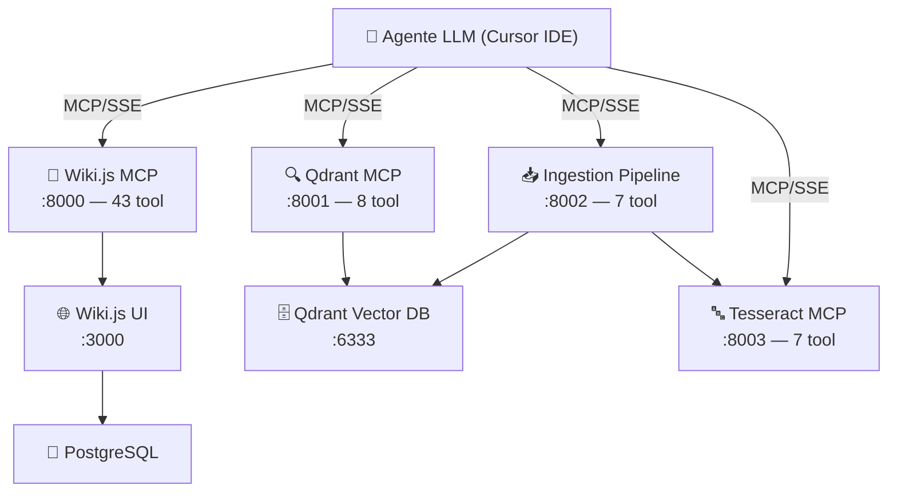

# 02 — Architettura

## Come funziona per un umano

wiki-js-mcp e' composto da **4 server MCP indipendenti**, ciascuno specializzato in una funzione. Tu (o meglio, il tuo agente LLM) parli con questi server tramite il protocollo MCP (Model Context Protocol) in modalita' **SSE** (Server-Sent Events). I server girano in **8 container Docker** (7 a regime, uno di inizializzazione).

Il concetto chiave: l'agente LLM **orchestra** i 4 server. Tu chiedi cose in linguaggio naturale e l'agente decide quali tool chiamare, su quale server, in quale ordine.

## I quattro server spiegati

### Wiki.js MCP (`:8000`, ~43 tool)

Il **cervello operativo**. Gestisce tutto cio' che riguarda le pagine wiki: creazione, modifica, ricerca, import/export, backlink, grafo dei link, e health check. Parla con Wiki.js via GraphQL, che a sua volta scrive su PostgreSQL.

Tool principali: `wikijs_create_page`, `wikijs_search`, `wikijs_smart_query`, `wikijs_get_backlinks`, `wikijs_wiki_health`.

### Qdrant MCP (`:8001`, 8 tool)

Il **motore di ricerca semantica**. Gestisce collezioni di embedding vettoriali e permette di cercare per **significato**, non per parole chiave. Usa il modello `all-MiniLM-L6-v2` per generare embedding.

Tool principali: `qdrant_search`, `qdrant_upsert`, `qdrant_list_collections`.

### Ingestion Pipeline (`:8002`, 7 tool)

La **catena di montaggio** dei documenti. Prende un file grezzo (PDF, DOCX, Markdown, immagine), lo processa in 5 fasi: Detect (tipo file) → Extract (testo) → Chunk (spezzetta in porzioni) → Embed (genera vettori) → Upsert (carica su Qdrant).

Tool principali: `ingest_document`, `ingest_status`.

### Tesseract MCP (`:8003`, 7 tool)

Il **lettore OCR**. Estrae testo da immagini e PDF scansionati usando Tesseract, con preprocessing adattivo (raddrizza, riduce il rumore, regola la soglia) per massimizzare la qualita' del riconoscimento. Supporta inglese e italiano.

Tool principali: `ocr_extract_text`, `ocr_extract_hocr`, `ocr_confidence`.

## Come l'agente li orchestra

Quando chiedi all'agente _"Ingerisci questo PDF e dimmi cosa contiene"_, lui ragiona cosi':

1. Chiama `ingest_document` sulla **Ingestion Pipeline** per processare il PDF
2. La pipeline internamente usa **Tesseract** se il PDF contiene scansioni
3. Il testo viene chunk-ato, embedded e caricato su **Qdrant**
4. L'agente chiama `qdrant_search` per recuperare i chunk rilevanti
5. Se serve una pagina wiki, chiama `wikijs_create_page` sul **Wiki.js MCP**

Tutto questo senza che tu debba sapere quali tool esistono o su che porta girano.

---

*Approfondisci in: [doc_v3/architecture/system-overview.md](../doc_v3/architecture/system-overview.md)*

*Precedente: [01 — Introduzione](01-introduzione.md) · Prossimo: [03 — Installazione e setup](03-installazione-e-setup.md) · Torna all'[indice](index.md)*
